# Machine Learning Papers Notes (CNN)
Compiled by Patrick Liu 

This note covers advancement in computer vision/image processing powered by convolutional neural network (CNN) in increasingly more challenging topics from **Image Classification** to **Object Detection** to **Segmentation**. 

<!-- vim-markdown-toc GFM -->

* [Image Classification](#image-classification)
	* [AlexNet (NIPS 2012)](#alexnet-nips-2012)
	* [VGG16 (ICLR 2015, 09/2014)](#vgg16-iclr-2015-092014)
* [Object Detection](#object-detection)
	* [Review blogs](#review-blogs)
	* [R-CNN](#r-cnn)
	* [OverFeat](#overfeat)
	* [Fast R-CNN](#fast-r-cnn)
	* [Faster R-CNN](#faster-r-cnn)
	* [YOLO](#yolo)
	* [YOLOv2 and YOLO9000](#yolov2-and-yolo9000)
	* [SSD](#ssd)
	* [Extended reading](#extended-reading)
* [Segmentation](#segmentation)
	* [Review blogs](#review-blogs-1)
	* [FCN (Fully connected networks)](#fcn-fully-connected-networks)
	* [U-net](#u-net)
	* [3D U-Net](#3d-u-net)
	* [V-Net](#v-net)
	* [FPN (Feature pyramid network)](#fpn-feature-pyramid-network)
* [Instance/Object segmentation](#instanceobject-segmentation)
	* [DeepMask](#deepmask)
	* [SharpMask](#sharpmask)
	* [MultiPath Network](#multipath-network)
	* [Mask R-CNN](#mask-r-cnn)
	* [Polygon RNN (2017 CVPR)](#polygon-rnn-2017-cvpr)

<!-- vim-markdown-toc -->

## Image Classification
Goal: Predict a label with confidence to an entire image.

Evolution from AlexNet, VGGNet, GoogLeNet (Inception) to ResNet.
### AlexNet (NIPS 2012)
- [ImageNet Classification with Deep Convolutional Neural Networks](https://papers.nips.cc/paper/4824-imagenet-classification-with-deep-convolutional-neural-networks)
- Main contributions:
	- ReLU: non-saturating neurons significantly speeds up training.
	- Efficient multi-GPU implementation: cross GPU parallelization in that GPUs can read from and write to one another's memory without going through host machine memory.
	- LRN (local response normalization): this was reported as largely ineffective per VGG
- Architecture
	- 8 layers: 5 conv + 3 fully connected (FC)
	- Fixed input size: 224 x 224 x 3
	- 2 GPU, 2 branches
	- Inter-GPU data sharing only in certain layers
	- Note that the overall size of block is that of images, and inner blocks are conv filters (neurons)

- Training
	- Images are resized to 256x256, and randomly cropped to 224x224 for data augmentation.
	- 2 techniques to provide overfitting: 
		- **Data augmentation**: label-preserving transformation
		- **Dropout**: neurons that are dropped out do not contribute to forward pass nor back-propagation. This reduces complex co-adaptations of neurons, as a neuron cannot reply on the presence of particular other neurons. It roughly doubles the training time when dropout probability p=0.5. 
	- Loss function: multinomial logistic regression objective (softmax)
	- Learning update with momentum 0.9 and weight decay 0.0005
		1. $v_{i+1} := 0.9 v_i - 0.0005 \cdot \epsilon \cdot w_i - \epsilon \left< \frac{\partial L}{\partial w} \mid _{w_i} \right>_{D_i} $
		2. $	w_{i+1} := w_i + v_{i+1}$
	- Learning schedule: divide learning rate by 10 when validation error rate stopped improving 
- Results:
	- 1st conv layers learned a variety of frequency- and orientation-selective kernels and colored blobs
	- Specialization of filters on two GPUs due to restricted connectivity
	- Feature activations in the last hidden layer (4096-dimensional vectors) provide a good representation of image similarities in the image. 
	- **Efficient image retrieval** can be realized through this vector, or even compressed short binary code using autoencoders. This is better than grouping low level features in the image domain as similar patterns of edges does not mean *semantic* similarity.
- [tidbits] 
	- ImageNet's labels were gathered using Amazon's mechanical turk.
	- Due to genuine ambiguity of the intended focus of the images, **top-5 error rate** is more representative than **top-1 error rate**.

### VGG16 (ICLR 2015, 09/2014)
- [Very Deep Convolutional Networks for Large-Scale Image Recognition](https://arxiv.org/abs/1409.1556)
- This study investigate the importance of depth in CNN. VGG has very simple architecture design by stacking layers of small filters with only 3x3 receptive field.
	- Stacking small (3x3) filters can be used to approximate larger filters. It decreases the number of parameters and are thus easier to train and less prone to overfit.
- Architecture
	- 16 or 19 
	- Fixed input size: 224 x 224 x 3
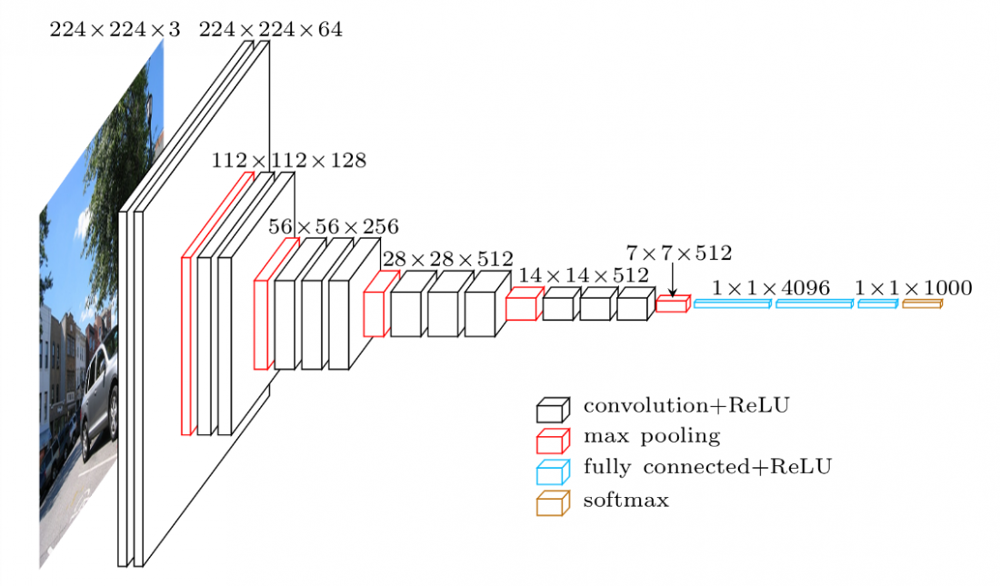
- Parameter count
	- ~140M (cf [cs231n](http://cs231n.github.io/convolutional-networks/#case)), larger than AlexNet but smaller than contemporary networks due to simple 3x3 filters.
- Training
	- $S$ is the training scale, the size of image from which the 224x224 training patches are cropped from.
	- Training was performed on the shallowest network first, and then the first conv layers and the FC layers are used to initialize deeper networks.
	- **Single scale training**: $S \in \{256, 384\}$.
	- **Multiple scale (jittered) training**: $S \in [S_{min}, S_{max}]= [256, 512]$ 
- Testing
	- $Q$ is the test scale, defined similarly to $S$. Using several Q's for each S leads to better results. 
	- Change VGG to **Fully convolutional network (FCN)** by changing FC layers to convolutional layers, and apply to rescaled test data densely (in a convolutional manner). The result is a class score map (instead of a single score), which is then spatially averaged (sum-pooled) to obtain a fixed size vector. This implementation is computationally **efficient** as it avoids redundant computation over overlapping crops.
	- **Single scale evaluation**: Q=S for fixed S, and $Q = (S_{min} + S_{max})/2$ for jittered S. Scale jittering at training leads to significantly better results, as it helps to capture multi-scale image statistics.
	- **Multi-scale evaluation**: $Q \in \{S-32, S, S+32\}$ for fixed S, and $Q \in \{S_{min}, (S_{min} + S_{max})/2, S_{max}\}$ for jittered S. 
 	- **Multi-crop evaluation**: takes more time
 	- Fusion of the above two: ensemble leads to better results. 
- CNN can be used as a black-box feature extractor for various other tasks. 
	- CNN features + SVN for classification on PASCAL VOC and CALTECH datasets
	- CNN features for human action classification

## Object Detection
Goal: Predict a label with confidence, as well as the coordinates of a box bounding each object in an image.

The evolution from R-CNN (regions with CNN-features), Fast R-CNN, Faster R-CNN, YOLO (YOLOv2 and YOLO9000) and SSD.

### Review blogs
[A Brief History of CNNs in Image Segmentation: From R-CNN to Mask R-CNN](https://blog.athelas.com/a-brief-history-of-cnns-in-image-segmentation-from-r-cnn-to-mask-r-cnn-34ea83205de4)

### R-CNN
- [R-CNN: Rich feature hierarchies for acurate object detection and semantic segmentation, Tech Report v5](https://arxiv.org/abs/1311.2524), [link ppt](https://courses.cs.washington.edu/courses/cse590v/14au/cse590v_wk1_rcnn.pdf)
- Two ways to alleviate the problem of limited availability of annotated data: 
	- data augmentation
	- **supervised** pre-training prior to domain specific fine-tuning (transfer learning).
- [Tidbits] Before CNN dominates ILSVRC, ensemble systems that combine multiple low-level image features (HOG-like, e.g.) with high-level context were taking the lead. In retrospect, this also generates hierarchical features, the same as CNN.
- [Tidbits] AlexNet's twists on top of LeCun's CNN: use of ReLu activation function and dropout regularization.
- R-CNN explores the question of how to transfer CNN classification results to object detection.
- Architecture:
	- Region proposal: ~2000 (rectangular) category-independent regions for each input image are proposed on the fly by **selective search** (see [implementation in Python here](http://www.learnopencv.com/selective-search-for-object-detection-cpp-python/)).
	- **Affine warping** each region into the input size of CNN (e.g., 227x227 for AlexNet). This generates a fixed length feature (4096-dimensional for AlexNet).
	- Category-specific **SVM** to classify each region.

- Training:
	- Pre-training with large dataset (ImageNet) with image-level annotations only
	- Fine-tuning on small dataset (PSACAL). Proposed regions with labels are also needed for training to match the test inference application. Such rraining data are generated by assigning labels to the regions proposed by selective search based according to the IoU value with the ground truth (assign ground truth box's label to proposed region if they have >= 0.5 IoU overlap).
		- Bounding box **dilation** helps to increase detection accuracy.
		- Fine-tuning the whole net yields beter results than using CNN as a blackbox feature extractor without fine-tuning.
	- With features extracted (using fine-tuned network) and training labels assigned, we optimize one linear SVM per class. Standard hard negative mining method^(==to read==) was used.
	- Note that it is possible to obtain close to the same level of performance withotu training SVMs after fine-tuning. The SVM was a historical artifact as it was first used on featured extracted by blackbox AlexNet without fine-tuning.
- Inference:
	- The main metric was **mAP (mean Average Precision)**.
	- The definition of AP and mAP comes form information retrival. This [link](https://makarandtapaswi.wordpress.com/2012/07/02/intuition-behind-average-precision-and-map/) explains the intuition behind it.
- Visualization of learned features
	- First layer capture oriented edges, patterns and blobs.
	- For more complex features in subsequent layers, e.g. pool_5 (last layer before FC layers in AlexNet), Compute a particular unit (feature) and compute the unit's actitvation on a held-out regions, sort the regions by activation, apply non-maximum suppression. This method let the selected unit **speak for itself** by showing exactly which inputs it fires on.
- [**Ablation study**](https://www.quora.com/In-the-context-of-deep-learning-what-is-an-ablation-study) studies the performance of the network by removing some features from the network, e.g., each layer.
	- This is a great tool to examine which layers are critical for determining performance. It showed without fine-tuning, the final FC layer can be deleted (with 30% of all parameters) without hurting the accuracy.
	- It also reveals that much of CNN's reprensentational power  comes form the convolutional layers rather than from the much larger densely connected layers.
- Base architecture of choice
	- AlexNet was used as a fast baseline
	- VGG-16 can yield better performnance but at 7 times longer inference time.
- Dataset usage considerations
	- ILSVRC detection dataset has training, val, test sets. The training set is drawn from the classification task and is not exaustively annoated. The val and test sets were drawn from the same image distribution and are exaustively annotated.
	- Selective search is not scale invariant and thus all images are rescaled for region proposal.
	- Training cannot be relied only on training set as it is from a different image distribution. Val set is split roughly evenly into $val_1$ and $val_2$.
	- During training, $val_1$ and training set are used, and $val_1$ is used for hard negative mining (as it was exaustively annotated and training set was not).
- R-CNN for Semantic segmentation
	- Uses **CPMC** instead of selective search for region proposal
	- Uses foreground information in a bounding box (as two regions may have little overlap but have the same bounding box, e.g., ◪ and ◩)
	- Again, this is region based but not pixel based.
- Bounding box regression
	- It was found that the localization error was the main contribution to mAP error so a linear regressor based on the extracted features from pool_5 (last layer before FC layers) was used to transform the proposed bounding box $P$ (note that this bounding box was generated by selective search, not CNN) to ground truth bounding box $G$. Only closely located (P, G) pairs were used for training (IoU > 0.6).
- Relation with [OverFeat](#overfeat-integrated-recognition-localization-and-detection-using-convolutional-networks)
	- OverFeat uses multiscale pyramid of sliding window.
	- OverFeat is faster than R-CNN (to be improved by fast and faster R-CNN)
- R-CNN is "efficient" in two ways:
	- CNN parameters shared across all categories
	- feature vectors extracted by CNN are low-dimensional compared to conventional CV algorithms.
	- However, compuation is still **inefficient** due to possible large overlaps among proposed regions.

### OverFeat
- [OverFeat:
Integrated Recognition, Localization and Detection
using Convolutional Networks](https://arxiv.org/pdf/1312.6229.pdf)
- Overview
	- First publication on explaining how to use CNN to perform localization and detection. (AlexNet paper was focused on classification)
	- Proposed a aggregation method to combine many localization predictions. This eliminates the need to train on background samples.
	- Segmentation preprocessing or object proposal steps (e.g., selective search) drastically reduce unlikely object regions hence reducing false postives (e.g., R-CNN). 
		- Overfeat was able to win ILSVRC2013 localization using aggregation of localization predictions without resorting to object proposal step, but it was overtaken by R-CNN by a large margin.
- Detection vs localization
	- Largely the same
	- Detection dataset is more challenging as it contains many small objects while classification/localization typically contain a single large object. It can contain any number of objects (including 0) and thus false positives are penalized.
- Multiscale Classification (6 sizes of input images were used)
	- 3 steps:
		1. A spatial feature map is generated for each scale. The spatial max was selected.
		2. This leads to a C-dim (# of classes) vector at each scale. All vectors were averaged into a mean class vector
		3. from which top element(s) were selected. 
	- Note that this multiscale does not lead to huge improvement in classification. However, there are two interesting concepts.
	- A **shift-and-stitch** method were used to enhance the image resolution after convolution. 
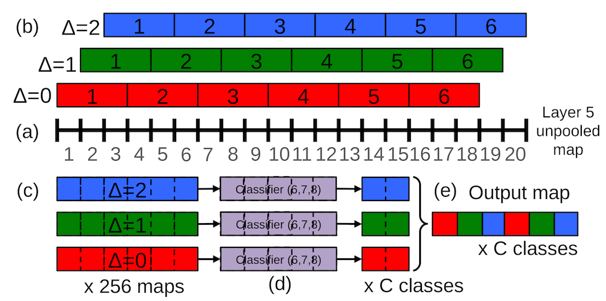
	- Sliding window is generally computationally intensive but it **inherently efficient** with CNN due to heavily amortized computation over overlaped windows. 
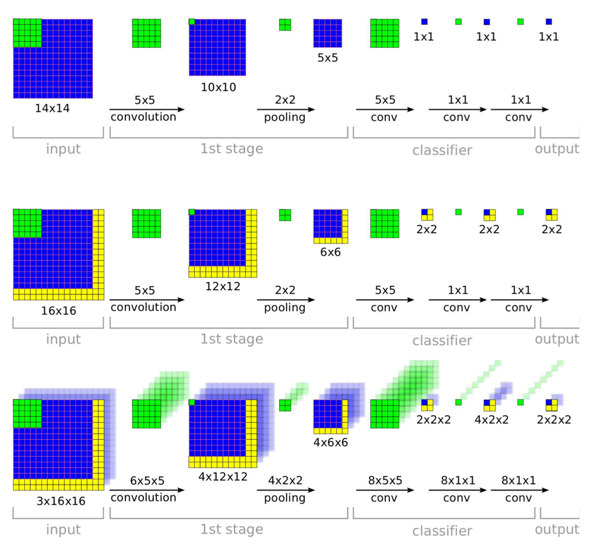
- Localization
	- Use pool_5 features to train a regressor network, 256 -> 4096 -> 1024 -> 4.

	- Each scale (6) and offset (3x3) generate a bounding box prediction, so there are a max of 54 bounding boxes for a single object. A **greedy merge strategy** are used to merge these bounding boxes together:
		1. $ (b'_1, b'_2) = \underset{b_1 \ne b_2 \in B}{argmin} \texttt{ match_score}(b_1, b_2) $
		2. 	If $\texttt{match_score}(b'_1, b'_2) > t$, stop
		3. Otherwise, set $B \leftarrow B\backslash {b'_1, b'_2} \cup \texttt{box_merge} (b'_1, b'_2)$
	- Compute `match_score` using sum of distance between centers of bounding boxes to the intersection of the boxes. `box_merge` compute the average of the bounding boxes coordinates.
	- This method is very robust to false positive than non-maximum suppresion by rewarding bounding box coherence.
- Detection
	- Very similar to localization except the necessity to predict a background class when no object is present.
	- **Bootstrapping** is used in training on negative examples^(==hard negative mining?==) 
- Limitations to be improved
	- Layers up to pool_5 are used as a blackbox feature extractor in localization. Fine-tuning (backprop all the way back) in localizaiton may give better result.

### Fast R-CNN
- [Link](https://arxiv.org/abs/1504.08083)
- Fast R-CNN (FRCN) streamlines the process, speeds up the training and inference, improves the accuracy of R-CNN.
	- Accelerated training by sharing computation between regions.
	- SPPnet (by He. et al) also set out to accelerate R-CNN but still uses a multi-stage training protocol. This requires feature caching (written to disk). It cannot update layers before the feature map, and thus uses CNN as a blackbox feature extractor. 
	- Thus streamlining the process leads to **end-to-end training with the possibility of fine-tuning all the layers**. This may need special treatment of backpropagating through certain ad-hoc operatinos (e.g., ROI pooling layer in Fast R-CNN).

- Architecture:
	- Takes in input image of arbitrary size and generate a feature map. 
	- For each region (proposed by selective search), a **ROI pooling layer** extracts a fixed length feature from the feature map.
	- Each feature is fed into a sequence of FC layers and branch into two sibling output layers: one produces softmax probability of the region over K+1 class + background, the other produces the four parameters (defining the transformation from proposed region $P$ to the bounding box $G$) for each of the K+1 classes. 

- Training
	- Single stage training that jointly learns to clasify and refine the spatial location.
	- Uses a multi-task loss function.
	\\[
	L(p, u, t^u, v) = L_{cls} (p, u) + \lambda [u \ge 1] L_{loc} (t^u, v)
	\\]
		- $L_{cls}(p, u) = -\log p_u$ (log loss function, [special case of cross entropy](https://jamesmccaffrey.wordpress.com/2016/09/25/log-loss-and-cross-entropy-are-almost-the-same/))
		- $[statement]$ is the Iverson bracket which evaluates to 1 when statement is true. There is no loss for the catch-all background class ($u=0$).
		- $L_{loc} = \underset{i \in {x, y, w, h}}{\sum} \text{smooth}_{L_1}(t_i^u - v_i)$ in which $\text{smooth}_{L_1}$ is the Huber function. This is more robust against outliers in the penalized $L_2$ loss in R-CNN. (cf scikit-learn topic of [Huber vs Ridge](http://scikit-learn.org/stable/auto_examples/linear_model/plot_huber_vs_ridge.html))
		- $\lambda$ controls the balance between the two task losses. Set to 1 in this study with normalized input. 
	- Stage wise training is less accurate (and less streamlined) than multitask training. 
	- Training on classification and detection simultaneously **(multitask training) improves pure classification accuracy**. This means the bounding box data used for detection also holds informtion relevant to classification.
	- Single-scale detection performes nearly as good as multiscale detection. Deep CNN are adept at directly learning scale invariance.
	- Softmax slightly performs SVM, so "one-shot" fine tuning is enough than multi-stage tuning with SVM. 
	- More region proposals do not lead to better predictions ane even slightly hurts accuracy (mAP). **Average Recall** (AR, wich summarizes recall over IOU threshold 0.5 to 1) measures the object proposal quality. It makes sense that AR increases monotonically with proposal count. 
	
- ROI pooling layers
	- Applied independently to each feature map channel as in standard max pooling.
	- Each ROI pooling layer computes $y_{rj} = x_{i^*(r,j)}$ where $r^*(r,j) = \text{argmax}_{i' \in \mathcal{R}(i, j)}x_{i'} $, $\mathcal{R}(r, j)$ is the index set over which $y_{rj}$ max pools.
	- Backpropagation: 
	\\[
		\frac{\partial L}{\partial x_i} = \sum_r \sum_j [i=i^*(r,j)]\frac{\partial L}{\partial y_{rj}}
	\\]
	the gradient of a node $x_i$ only accumulate only if it was selected as the maximum in the ROI pooling process for $y_{rj}$.
	
- **Not all** layers need to be fine tuned.
	-  Ablation studies showed that initial layers (up to the first 3 in Fast R-CNN) does not contribute much to accuracy boost. Fine-tuning is more important for deeper layers. Shallow layers (particularly the first one) is generic and task-independent. This saves both time and memory and has great implications when GPU memory is limited.
	-  However training through ROI pooling layer is indeed important for improving prediction. Therefore using CNN as a blackbox feature extractor yields suboptimal results.
	
- Detection
	- Non-maximum suppression used for each class to generate final bounding box.
	- **Truncated SVD** to simplify fully connected layers for faster inference:
		- A FC layer parameterized by $u \times v$ matrix $W$ can be approximated by SVD $W \approx U \Sigma_t V^T$. $\Sigma_t$ is a $t \times t$ matrix. The cutoff threshold t can be tuned. This gives good speedup during inference (not that this is not used to speed up training) as parameter count reduces from $uv$ to $t(u+v)$.

### Faster R-CNN
- [Faster R-CNN: Towards Real-Time Object Detection with Region Proposal Networks](https://arxiv.org/abs/1506.01497)
- Architecture
	- **Region Proposal Network (RPN)** is trained for region proposal
	- RPN is merged with Fast R-CNN with "attention" mechanism

- RPN history and properties
	- Region proposal became the **bottleneck** of real-time detection (proposal takes almost the same time as detection)
	- Reimplementing selective search on GPU may speed up calculation, but inefficient as it misses important opportunties to share computation
	- Features extracted by CNN can also be used for region proposal
	- RPN is fast (given features extracted by CNN) as the effective (incremental) time for regional proposal is ~ 10 msec
	- RPN can benefit from deeper networks, unlike SS which is predefined. RPN + VGG surpasses
- RPN architecture
	- Slide a $n \times n$ spatial window over extracted feature map.
	 	- At each location, k = 9 (3 scales x 3 aspect ratios) reference boxes (**anchors**) are initially proposed
	- Each window is mapped to a lower dim feature (256-d for ZF and 512 for VGG)
	- The feature is fed into two sibling FC layers, one for **cls** and the other for **reg**
		- The reg network performs bounding box regression from an anchor to a nearby groundtruth box
		- The cls network predicts the probabilities of the box being an object and background
- Anchors
	- Translation-invariant: this helps to reduce network size. For VGG, the parameter count is 512 x (4+2) x 9.
	- Multi-scale: the design of multiscale anchors is a key component for sharing features without etra cost for addressig scales
- Training
	- Generating training data: anchors are assigned 1 if IoU > 0.7 or highest IoU with a given groundtruth box.
	- Loss function: multitask (cls+reg)
	\\[
		L({p_i}, {t_i}) = \frac{1}{N_{cls}} \sum_i L_{cls}(p_i, p_i^*) \		+ \lambda \frac{1}{N_{reg}} \sum_i p_i^* L_{reg}(t_i, t_i^*)
	\\]
	where groundtruth label $p_i^*$ = 1 if anchor is positive, 0 othewise. $p_i$ is the predicted probability of anchor i being an object, $t_i$ is the parameterized coordinates of predicted bounding box (transformation from anchor), and $t_i^*$ is the corresponding groundtruth. $L_{cls}$ is log loss ($-\log p_i$, object vs background). $L_{reg} = R(t_i - t_i^*)$ where $R$ is the robust loss function (smooth $L_1$, Huber).
	- Fine-tuning VGG (13 conv + 3 FC) from conv3_1 and up as the shallower layers are very generic. Fine-tuning whole network for ZF (5 + 3).
	- 4-step Alternating training:
		0. Fine-tune a ImageNet-pretrained model for RPN.
		1. Fine-tune a ImageNet-pretrained model for Fast R-CNN with RPN proposal. No sharing up to this point.
		2. Fix detector network conv layers (now shared layers) and fine-tune unique RPN layers
		3. Fix conv layers and fine-tune unique R-CNN layers
	- Joint training by combining loss from two networks. This leads to close reults but up to 50% faster than alternating training.
	- Ignore cross-boundary anchors during training but enable during testing.
- Number of region proposal by NMS
	- Non-maximum suppression (NMS) on proposal regions. This leads to ~2000 regions for an IOU threshold of 0.7 during NMS.
	- However only up to 300 is used for RPN. Ablation studies showed RPN performs good even when proposal count drops from 2000 to 300 due to cls term of RPN. This proves the high quality of RPN region proposals. Also, fewer region proposals means faster detection.
	- 3 scales x 3 aspect ratios (AR) per feature map location were used to define anchors. 3 scales x 1 AR yields as good results, so AR is not as important. 
- RPN's 2-stage proposal + detection scheme beats the 1-stage detection proposed by OverFeat. It is also the building block for many top-performing detection systems in 2015.
	
### YOLO
- [You Only Look Once: Unified, Real-Time Object Detection](https://arxiv.org/abs/1506.02640)
- YOLO treats object detection as an end-to-end regression problem. This is different from previous methods (e.g. R-CNN and variants) which repurposes classifier networks for detection. YOLO trains on full images and optimizes a loss function directly related to detection performance (bounding box and object class). 
	- R-CNN starts with image **pre-processing** (region proposal), performs classification, followed by **post-processing** to refine bounding boxes and eliminate duplicate detections. 
- Characteristics of YOLO
	- Very fast running at 45 fps, thus a true real-time (> 30 fps) detector. Able to process streaming video in real-time.
	- Reasons globally about the image (thus makes less background errors than R-CNN). This leads to a strong ensemble with R-CNN and YOLO. 
	- Generalizes better when applied to a new domain (e.g., natural images -> art work) 
- Intended Workflow
	- Divides image to $S \times S$ grid
	- For each grid cell predicts $B$ bounding boxes and corresponding confidence, and $C$ class probabilities. 
		- Confidence of bounding box is defined as $\text{Pr(Object)} \times \text{IOU}_{pred}^{truth}$. If no object appears in the bb^(==how to decide? IOU threshold?==), the confidence should be 0; otherwise it should be the IOU with groundtruth. (this is implicitly reflected in the training by assigning label).
		- Each $C$ class probability is defined as $\text{Pr(Class}_{\textit i}\text{ | Object)}$. These is one set of probability for one gird cell, regardless of number of bb $B$.
		- At test time, the two numbers are multiplied, 
		\\[
		Pr(Class_i | Object) \times Pr(Object) \times \text{IOU}_{pred}^{truth} = Pr(Class_i) \times \text{IOU}_{pred}^{truth}
		\\]
		which gives the class-specific confidence score for each box. 
	- All predictions are encoded as an $S \times S \times (B \times 5 + C)$ tensor. For VOC, S=7, B=2, C=20, thus output dimension is 7 x 7 x 30.
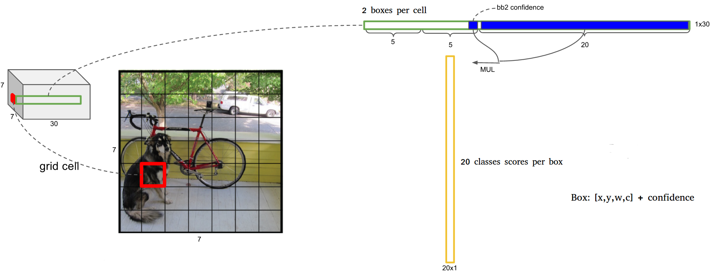
- Architecture
	- 24 conv layers + 2 FC layers
	- 1x1 reduction layers followed by 3x3 convolutional layers (instead of parallel inception module)
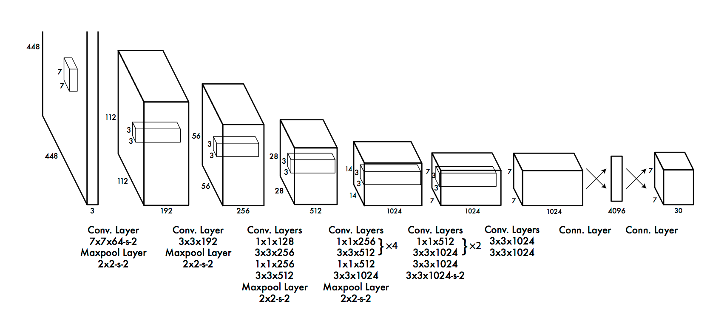
- Training 
	- First 20 layers (+ average pooling layer and 1 FC layer) pre-trained on ImageNet data
	- Added 4 conv layers + 2 FC layers on top of the first 20 layers in the classification network to improve performance.
	- **Leaky ReLU** was used
		- trying to fix the "dying ReLU" problem but the benefits has been inconclusive, according to [cs231n](http://cs231n.github.io/neural-networks-1/).
	- Loss function is modified **sum-squared error** (same as mean squared error, MSE) across all elements of the 7 x 7 x 30 output tensor, with the following modification (**note that the notation is floppy, all subscripts should start from 1**)
	
		- MSE weighs localization error the same as classification error. A $\lambda_{coord}=5$ was used to emphasize the bounding box loss. 
		- For grid that does not contain any object, the regression target is assigned to 0, often leading to overwhelming gradients. Thus $\lambda_{noobj}=0.5$ is used for better balance.
		- MSE penalizes big boxes the same as small boxes. This is **only partially** addressed by using sqrt of h and w. 
	- Heavy data augmentation (random scaling, translation, exposure and saturation in HSV)
- Limitations of YOLO
	- Strong spatial constraints on bounding box prediction due to the limited number (2) of bounding boxes per grid cell, leaving YOLO vulnerable to detect small objects in flocks. 
	- Predicts bounding box from data, and thus fails to generalize to new/unusual aspect ratio.
	- Penalizes small bb and large  bb the same way (same displacement more benign for large bb). This lead to incorrect localization, the main source of error of YOLO.

### YOLOv2 and YOLO9000
- [YOLO9000: Better, Faster, Stronger](https://arxiv.org/abs/1612.08242)
- YOLO9000 detects over 9000 categories. YOLO predicts detections for object classes that don't have labelled detection data. 
- Background: 
	- General purpose object detection should be fast, accurate and able to recognize a wide variety of objects.
	- Labelling images for detection is more expensive than labelling for classification (often user-supplied for free).
- YOLO leverages labeled detection images to learn to precisely localize objects and uses classification images to increase its vocabulary and robustness.
- Architecture 
	- Similar to YOLO, trains a classifier on ImageNet first
	- Resize network from 214 to 428, fine-tune on ImageNet (this fine tuning +3.5% mAP)
	- Fine-tune on detection: replaces FC layers with more conv layers and FC layers. 
	- Use anchor boxes to improve YOLO's recall. YOLO only predicts 7x7x2=98 boxes, but YOLOv2 predicts 13x13x5=845 boxes.
	- Fine grained features: add passthrough layers which brings features in the 26x26 resolution layer to 13x13 layer. It stacks adjacent features into different channels instead of spatial locations. 26x26x512 -> 13x13x2048 feature map.
	- **Multi-scale training** takes in images with varying image size during training (varying input size by multiples of 32, the downscaling factor of the network). This +1.5% mAP. This is akin to data augmentation. It keeps the same network architecture and weighting as the whole network is convolutional (no FC layers). This allows detection of differently scaled images, a smooth tradeoff between speed and accuracy.
- **Anchor boxes (from faster R-CNN and SSD):** Easier for network to learn the offset to anchor boxes rather than directly predicting bb. Based on the feature map with the size (input# / 32)^2, each of the cell in the map predicts (offsets wrt) $k$ anchor boxes. This +5% mAP.
	- YOLOv2 uses k-means clustering on the box dimensions of the **training set** to automatically find good priors of the anchor boxes (improves upon the hand-picked anchor boxes in faster R-CNN and SDD). $k=5$ is selected as it achieves good average IOU with relatively small k. 
	- k-means clustering metric
	\\[
	d(box, centroid) = 1 - IOU (box, centroid)
	\\]
	instead of Euclidean distance (which would bias against large boxes).
	- Predicts location coordinates relative to the location of the grid cell. This bounds the ground truth to (0, 1). This improves upon predicting offset wrt anchor boxes. ^(==why?==)
- [tidbits] Speed is not just FLOPs. Speed can also be bottlenecked by data manipulation in memory. 
- From YOLOv2 to YOLO9000 
	- YOLO9000 is jointly trained on classification and detection. 
	- Labels in different datasets are not mutually exclusive, resolved by a  **multi-label model** method.
- WordTree and hierarchical classification
	- Combining the COCO detection data (both classification and location data) with ImageNet classification data into a hierarchical training dataset. 
	- Performing softmax over siblings on each level, which are cascading conditional probabilities. 
	- WordTree does not help (surprisingly) with classification task alone, but slightly hurt performance. 
	- During training, backprop loss normally for detection data, but backprop only classification loss. Note that for classification loss, it is only backprop'ed  at or above the corresponding level of the label. 

	- Performance degrades gracefully on new or unknown object categories.
- [Youtube lecture](https://www.youtube.com/watch?v=GBu2jofRJtk)

### SSD
- [SSD: Single Shot MultiBox Detector](https://arxiv.org/abs/1512.02325)
- Architecture
	- Replaces the FC layers in YOLO with convolutional (3x3) predictors. This makes it faster tdsfhan YOLO.
	- Predictions of different scales from feature maps of different scales (increasingly larger scale prediction from coarser feature maps).
	- Uses anchor boxes to regress bb locations.
	- Base network is VGG16, but adapted similarly to DeepLab with atrous algorithm to gain speed. 
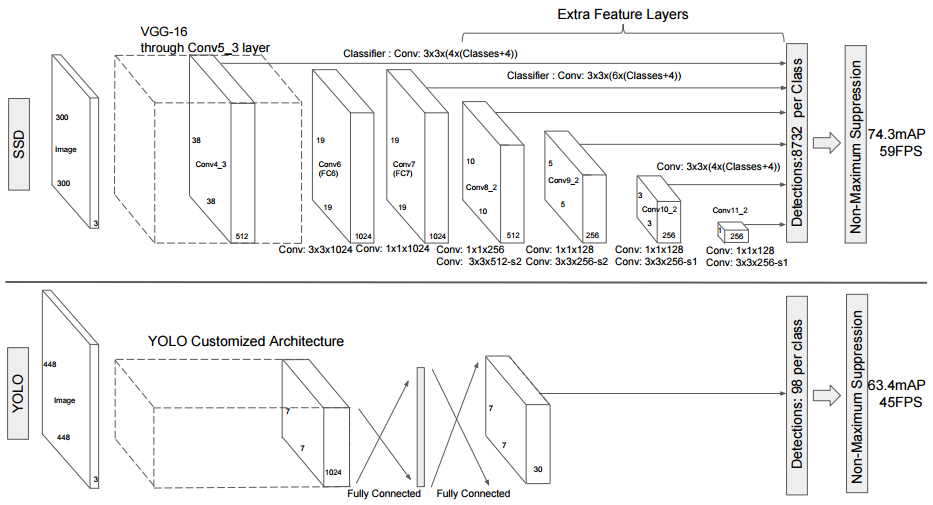
- Prediction
	- $c$ classes and 4 offsets, with $k$ anchor boxes per location in feature map.
	- Anchor boxes number $k$ is set to 6, with aspect ratios of 1/3, 1/2, 1, 1, 2, 3.
	- Total output $(c+4)kmn$ for a $m \times n$ feature map.
- Training
	- Ground truth information needs to be assigned to the outputs. 
	\\[
	x_{ij}^p=[\text{IOU}(\text{AnchorBox}_i, \text{GT}_j) >0.7]
	\\]
	- Loss function (training objective) is a weighted sum of localization loss (loc) and confidence loss (conf).
	\\[
	L(x, c, l, g) = \frac{1}{N} (L_{conf}(x, c) + \alpha L_{loc}(x, l, g))
	\\]
	following $L_{loc}$ of faster R-CNN, and confidence is a [softmax (corss-entropy) loss](http://cs231n.github.io/linear-classify/#softmax).
	- Balancing pos/neg data: sort negative training examples by confidence loss till pos/neg = 1/3. This leads to faster and more stable training.
	- Data augmentation by heavily padding original image before cropping. This creates "zoom-out" effect. 
- Review of object detectors: R-CNN is improved in different ways
	- Improve post-classification: SPPnet -> Fast R-CNN
	- Improve region proposal: Faster R-CNN (RPN) uses CNN for region proposal, but need to merge two CNNs by alternating training.
	- Merge the whole pipeline: OverFeat, YOLO (and YOLOv2, YOLO9000) and SSD. 
		- OverFeat only looks at one bounding box per location
		- YOLO only looks at the top feature map, uses FC layer for prediction, do not consider aspect ratio directly
		- SSD looks at multiple feature maps, uses a conv layer for prediction, and uses anchor boxes (proposed by Faster R-CNN)
		- YOLOv2 looks at the top feature, but uses multi-scale training (with varying input size), and with k-mean clustered anchor boxes

### Extended reading
- [**Review**: Speed/accuracy trade-offs for modern convolutional object detectors](https://arxiv.org/abs/1611.10012)
- [R-FCN: Object Detection via Region-based Fully Convolutional Networks](https://arxiv.org/abs/1605.06409)
- [ION: Inside-Outside Net: Detecting Objects in Context with Skip Pooling and Recurrent Neural Networks](https://arxiv.org/abs/1512.04143)
- [Multibox: Scalable Object Detection using Deep Neural Networks](https://arxiv.org/abs/1312.2249)
- DSSD: Deconvolutional Single Shot Detector
- TDM: Beyond Skip Connections: Top-Down Modulation for Object Detectio

## Segmentation
Goal: **Semantic segmentation** aims at grouping pixels in a semantically meaningful way and are, therefore, pixel-wise segmentation. It predicts a label with confidence for each pixel in the image.

**Instance classification** is more challenging in that it include object detection. See [illustration below](http://cs.nyu.edu/~silberman/projects/instance_segmentation.html) for an example.

### Review blogs
- [Semantic Segmentation using Fully Convolutional Networks over the years](https://meetshah1995.github.io/semantic-segmentation/deep-learning/pytorch/visdom/2017/06/01/semantic-segmentation-over-the-years.html)

### FCN (Fully connected networks)
- [Fully Convolutinal Networks for Semantic Segmentation](https://arxiv.org/abs/1605.06211)
- FCN adapts the classification networks for dense prediction, making it capable of localizatio tasks as well. Both learning and inference are performed whole-image-at-a-time.
- Architecture
	- Typical classifier nets take fixed-sized inputs.
	- **KEY STEP**: Fully connected (FC) layers can also be viewed as convolutions with kernels that cover their entire input regions. Doing so cast the classification nets to fully convolutional networks (FCN) that take **input of any size** and make spatial output maps. 
	- Although resulting maps are equivalent to the evaluation of original net on particular input image patches, the computation is **highly amortized** over the overlapping regions of those patches.
	- Although casting the nets to a fully convolutional manner will provide some localization information, the resulting image will be one with lower resolution due to max-pooling layers.
	- Addition of **skip connections** helps with the coarse prediction limited by the stride (due to **max-pooling**) of the convolution layers. This combines *where* (localizatino information from shallower layers) and *what* (classification information from deeper layers) of the network.
- Skip connections:

	- FCN-32s: Start with VGG-16 and convolutionalize the fully connected layer, perform 32x upscaling from the final stride-32 layer.
	- FCN-16s: Start with FCN-32s, concatenate stride-16 with 2x upscaled stride32 layers first, then perform a 16x upscaling. 
	- FCN-8s: Start with FCN-8s, concatenate stride-8 with 2x upscaled stride-16 layers and 4x upscaled stride-8 layers.
	- The 2x interpolation layers is initialized to bilinear interpolation
- Training
	- **Fine-tuning** only the final classification layer only yields 73% of the the full fine-tuning performance. 
	- Training all-at-once yeilds similar results to training in stages (FCN-32 first, then FCN-16, finally FCN-8) yields very similar results but only takes about half the time. However each stream needs to be scaled by a fixed constant to avoid divergence.
	- Class balancing: by weight or sampling the loss. ^(c.f. 3D U-net, ==need more investigation==) Mildly unlablanced datasets (1:3, e.g.) do not need rebalancing.
	- **Upsampling** needs to be defined as convolution for end-to-end training and inference. See details in this [blog](http://warmspringwinds.github.io/tensorflow/tf-slim/2016/11/22/upsampling-and-image-segmentation-with-tensorflow-and-tf-slim/).^(==need to read==)
- Evaluation
	- $n_{ij}$ is the number of pixels of class i predicted to be class j.
	- $t_i = \sum_j n_{ij}$ is the total number of pixels of class i.
	- pixel accuracy: $\sum_i n_{ii} / \sum_i t_i = \sum_i n_{ii} / \sum_{ij} n_{ij}$
	- mean accuracy: $(1/n_{cl}) \sum_i n_{ii}/t_i$
	- mean IU: $(1/n_{cl}) \sum_i n_{ii}/(t_i + \sum_j n_{ji} - n_{ii})$
- Momentum
	- Higher momentum is needed for batch size. $p^{1/k} = p'^{1/k'}$. For example, for momentun 0.9 and a batch size of 20, an equivalent training regime may be a momentum of $0.9^{1/20} \approx 0.99$ and a batch size of one, which is equivalent of **online learning**. In general, online learning yields better FCN models in less wall clock time.
	
- Extensions
	- [DIGITS 5 from Nvidia](https://devblogs.nvidia.com/parallelforall/image-segmentation-using-digits-5/)^(==need to read==)

### U-net
- [U-net: Convolutional Networks for Biomedical Image Segmentation](https://lmb.informatik.uni-freiburg.de/people/ronneber/u-net/)
- From classification to localization (a class label is supposed to be assigned to each pixel)
- Ciresan trained a network in a sliding window setup to predict the label of each pixel by providing an image patch surrdounding it. 
	- Pros: 
		- able to localize
		- training data is much larger than the number of training images
	- Cons:
		- inefficient due to redundancies
		- tradeoff between localization accuracy (small image patches and the less use of pooling layer) and the use of context (large image patches)
- U-net is based on **fully convolutional netwowrk**.
- Architecture
	- Contracting layers + expanding (upsampling) layers
	- Concatenation with the correspondingly cropped feature map from the contracting path

- Data handling
	- Extrapolation by mirroring is used with valid padding on the boarder where data is missing.
	- Overlap-tile strategy is used to allow segmentation of arbitrarily large input.
	- Excessive data augmentation by applying **elastic deformation** for the network to learn such invariances. This is the key to train a segmentation network with very few (~30) annotated images.
	- Output is a series of map, each representing the probability of a pixel belonging to a certain class.
- Training
	- A large **momentum** (0.99) is used due to smaller batch size used (=1 image patch)
	- Deep neural networks usually has an objective with the form of a long shallow ravine leading to the optimum with steep walls on the sides. Standard SGD has very slow convergence rate after the initial steep gains. Momentum can be used to push the objective more quickly along the shallow ravine. [link](http://ufldl.stanford.edu/tutorial/supervised/OptimizationStochasticGradientDescent/) Therfore momentum update is almost always better than vanilla SGD. [CS231n](http://cs231n.github.io/neural-networks-3/#sgd)
	- Momentum is particularly important when using small batches because it allows derivatives to be integrated across batches. The smaller the batch size, the greater the momentum you may want to use. [link](http://tedlab.mit.edu/~dr/Lens/thumb.html)
- Evaluation
	- Review section in the summary of [ISBI-2012](http://journal.frontiersin.org/article/10.3389/fnana.2015.00142/full)
	- As segmentation algorithms are generally embedded in semiautomatic systems that enables human experts to correct the mistakes of the algorithms, it is useful to define a "nuisance metric", but it is highly subjective.
	- Human effort is required to correct **split errors** and **merge errors**, which can be used as proxies for the nuisance metric.
	- Pixrl error: the easiest measure of segmentation performance, but does not reflect the human effort involved to correct split or mergr error, thus inadequate.
	- **IOU** (IoU, intersection over union, or [Jaccard index](https://en.wikipedia.org/wiki/Jaccard_index)) is a widely used pixel error metric to evaluate segmenation algorithms (~90% is pretty good)
	- **Rand error**: non-local, region based method. More robust and best matches qualitative human judgement.
		- Define $p_{ij}$ as the probability that a pixel belonging to segment i in S (predicted segmentation) and segment j in T (ground truth segmentation). The joint probability distribution satisfies $\sum_{ij} p_{ij} = 1$ by definittion.
		- $s_i = \sum_j p_{ij}$ is the probability of a randomly chosen pixel belonging to segment i in S.
		$$
		V^{Rand}_{split} = \frac{\sum_{ij}p_{ij}^2}{\sum_k t_k^2}, \quad\quad V^{Rand}_{merge} = \frac{\sum_{ij}p_{ij}^2}{\sum_k s_k^2}.
		$$
		- The merge score $V^{Rand}_{merge}$ is the probability that two randomly chosen voxels belong to the same segment in T, given that they belong to the same segment in S. The merge score is higher when there are fewer merge errors. The split score is defined similarly.
		- The Rand F-score is defined as the weighted harmonic mean
		$$
		V_\alpha^{Rand} = \frac {\sum_{ij} p^2_{ij}} 
		{\alpha \sum_k s_k^2 + (1-\alpha) \sum_k t_k^2}
		$$
		Generally $\alpha = 0.5$, which weighs split and merge errors equally. The Rand score is closely related to the Rand index.
		
		
### 3D U-Net
- [3D U-Net: Learning Dense Volumetric Segmentation from Sparse Annotation](https://arxiv.org/abs/1606.06650)
- 3D U-net is an end-to-end training scheme for 3D (biomedical) image segmentation based on the 2D counterpart U-net. It also has the analysis (contracting) and synthesis (expanding) paths, connected with skip (shortcut) connections.

- 3D U-net takes 3D volumes as input and process them with 3D operations (3D convolution, 3D max pooling, 3D up-convolution). 
- Biomedical images has the special advantage that properly applied rigid transformations and slight elastic deformations still yield **biologically plausible** images. In addition, each image already comprise repetitive structures with corresponding variations. Combined they allow efficient training of neural networks on sparsely annotated data. (In 3D, 2 volumes are enough to train a network from scratch and perform segmentation on the 3rd volume.)
- Batch normalization (BN) is used in preference to previously used He initialization (Gaussian distribution with $\sigma=\sqrt{2/N}$) for faster convergence.
- Weighted softmax loss function (0 for unlabled regions as they do not contribute to loss function, reduced weighting for frequently seen background, and increased weighting for rare classes, in the interest of more balanced influence from different classes on loss function)
- Results
	- BN: better accuracy (IoU) is achieved with BN
	- 3D context: contributes positively to the segmentation accuracy (compared with treating each slice independently).
	- Number of slices: diminishing return after a few slices (a couple of percentage of total number)

### V-Net
- [V-Net: fully Convolutional Neural Network for Volumentric Medical Image Segmentation](https://arxiv.org/abs/1606.04797)
- V-net improves upon U-net in two aspects:
	- Capable of performing 3D operations (like 3D U-net)
	- Added residual connections between the first and last steps of each stage of convolution layers (between pooling operatios)
		- redisual connections lead to faster convergence
	- Replaced pooling operations with convolutinal ones
		- cf: the all convolutional net (arXiv:1412:6806)^(==to read==)
		- smaller memory footprint (no switches mapping the poutput of pooling layers back to the inouts are needed for backprob)^(==why? How does backprob work in pooling layers?==)

- Objective function based on Dice coefficient
	- [Dice coefficient](https://en.wikipedia.org/wiki/S%C3%B8rensen%E2%80%93Dice_coefficient): a statistic used for comparing the similarity of two samples
	- $S={\frac {2|X\cap Y|}{|X|+|Y|}}$, which is related to Jaccard index (IoU), $J=\frac{|X \cap Y|}{|X \cup Y|}$, in that $S = 2J/(1+J)$ and both $S, J \in (0, 1)$.
	- The improved loss function is:
	$$
	D = \frac{2\sum_i^N p_i g_i}
			  {\sum_i^N p_i^2 + \sum_i^N g_i^2},
	$$ where predicted binary segmentation $p_i \in P$ and ground truth binary volume $g_i \in G$. This Dice coefficient can be differntiated $\partial D/\partial p_j$ with respect to the $j$-th voxel of prediction.
	- The authors *claimed* that using this loss function eliminates the need to adjust the weight of loss for different classes to address class imblancement.^(==Why?==)
- Training
	- Data augmentation performed on-the-fly to avoid the othewise excessive storage requirement. 2x2x2 control points and B-spline interpolation
	- High momentum of 0.99, following U-net.
- Inference
	- The input images are **resampled** to a common resolution of the input images. This should be necessary for preprocessing of input data as well.
- Additional notes:
	- The main capability of CNN is to learn a hierarchical representation of raw input data, without replying on handcrafted features. 
	- The naive solution to segmentation uses patchwise classification but only considers local context and suffers from efficiency issues too.
	- To avoid information bottleneck, the number of channels doubles when the resolution of the images halves.

### FPN (Feature pyramid network)
- [Feature Pyramid Networks for Object Detection](https://arxiv.org/abs/1612.03144)
- Blogs:
	- http://www.cnblogs.com/everyday-haoguo/p/Note-FPN.html
- FPN proposes a clean and systematic way to leverage features at different scales. This helps to address the difficulty in detecting small items. 
- Architecture
	- (d) is FPN, a top-down architecture with skip connections, which predicts independently at all levels,
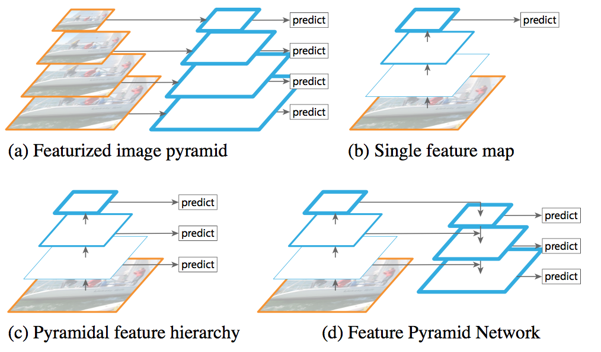

## Instance/Object segmentation
Instance segmentation involves challenges from object detection with bounding boxes and semantic segmentation.
Facebook AI Research (FAIR) has a series of progressive research on on DeepMask, SharpMask and MultiPath Network. Here is a [blog post review by Piotr Dollar](https://research.fb.com/learning-to-segment/), and here is [another one](https://adeshpande3.github.io/Analyzing-the-Papers-Behind-Facebook%27s-Computer-Vision-Approach/)

### DeepMask
- DeepMask tackles the problem of **instance segmentation** with a pure CNN approach. Note that **DeepMask and SharpMask do not perform object classification.**
- Deep mask generates class-agnostic segmentation mask with object score (whether the input patch **fully** contains a **centered** object) from fixed-size image patches (3x224x224).
	- This is in contrast with the RPN (region proposal network) from faster R-CNN and MultiBox. DeepMask generates segmentation masks instead of the less informative bounding box proposal. 
	- The segmentation mask can also be used to generate **bounding boxes** by taking the bounding box enclosing the segmentation mask.
	- DeepMask can be used for **region proposal** as well, and it increases recall at a much small number of proposals. See MultiPath Network.
- Architecture
	- DeepMask uses VGG as backbone CNN
	- Two parallel paths predicting both the mask and the object score. The network is trained jointly on a multi-task loss function.
	- The mask has $h \times w$ pixel classifiers each predicting whehter a given pixel blongs to the object in the **center** of the input path. This is **unlike semantic segmentation** when multiple objects are present. 
	- The upsampling layer in the mask path is fixed (non-trainable) bilinear filter, not learned.

- Loss function
	\\[
	L(\theta) = \sum_k \left[\frac{1+y_k}{2 w^o h^o} \sum_{ij} \log(1+e^{m_k^{ij} f_{seg}^{ij}(x_k)}) + \lambda \log(1+e^{-y_k f_{score}(x_k)}) \right]
	\\]
	- Binary logistic regression loss.
	- The object score $y_k \in {+1, -1}$ indicates whether the input path fully contains a centered object. Thus the loss function does not penalize over negative examples. This is critical in generalizing beyond the object categories seen during training (otherwise the unseen object would be inadvertently penalized).
	- Note that $y_k = -1$ even if an object is partially present. 
- Training
	- Object score $y_k$ take on binary values. ==This may be improved by using IOU with ground truth?==
	- The $y_k$ is assigned to +1 for patches which fully contains a centered object with some tolerance to increase the robustness of the model.
- Inference
	- The model is applied densely at multiple locations, with a constant stride but different scales, but the input patch is always fixed-sized. 
	- The predicted mask is binarized with a global threshold (0.1 or 0.2 for different datasets).
	- The accuracy of the model is benchmarked on the metric of IoU, for mask and for bounding boxes. Note that the model is not trained directly on the accuracy.
- [tidbits] selective search uses superpixel merging for region proposal. See [review by Hosang et al](https://arxiv.org/abs/1502.05082). 

### SharpMask
- [Learning to Refine Object Segments](https://arxiv.org/abs/1603.08695)
- SharpMask improves upon DeepMask by adding a top-down architecture to capture higher resolution features from earlier layers. 
- Architecture
	- Bottom-up / top-down architecture. It is **very much like U-Net**, but note that the top/bottom definition is reversed. 
	- The refinement module inverts the effect of pooling. It uses a bilinear upsampling by a factor of 2 to increase the spatial resolution of the feature maps. 
	- $k_m^l > 1$ allows the system to capture more than a mere segmentation mask, and is **key** for obtaining good accuracy. This means the feedforward + skip architecture (see fig1b) averages features from different layers and is effective for semantic segmentation, but is inadequate for instance segmentation as local receptive fields are insufficient to differentiate  between object instances. (i.e., skip network itself is not effective)
	- The horizontal skip connections are also critical for effectively incorporating the higher spatial resolution features (i.e., deconv network itself is not effective). 
	- Directly concatenating F with M poses two challenges: $k_f^i >> k_m^i$ so the contracting path may drown the expanding path; the computation burden is large. Therefore skip features $S^i$ are created. 
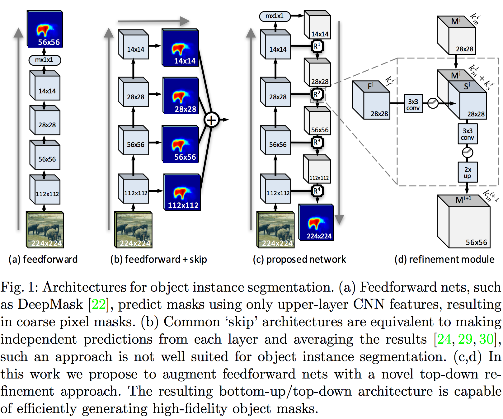

- Efficient computation
	- Network head for DeepMask can be progressively simplified with increased efficiency (reduced inference time) without hurting effectiveness. Both the objectiveness score and the mask can be predicted from a single compact 512 dimensional vector. 

	- Skip features are shared by overlapping image patches and can be computed efficiently. There are new ways to refactor the refinement module (swapping 3x3 conv on S and M respectively first and then concatenate) for even more efficient computation.

- Training 
	- Two stage training: train feedforward (DeepMask), freeze it, then train refinement module.
	- Reflective padding (instead of 0-padding) to keep the original image size after convolution. 
- SharpMask, like DeepMask can be used as object proposal methods and coupled with Fast R-CNN for object detection. 
- Performance Metrics
	- Object proposal: AR, average recall.
	- Object detection: AP, average precision.

### MultiPath Network
- [A MultiPath Network for Object Detection](https://arxiv.org/abs/1604.02135)
- Multipath improves upon standard Fast R-CNN
	- Skip connections gives the detector access to features at multiple resolution
	- "Foveal" structure (concentric ring) exploits object context at multiple scales
	- integral loss function favors better localization
	- Uses DeepMask for object proposal (to replace selective search which is based on low level grouping of superpixels)
- Architecture
	- Skip connection: ROI pooled normalized features from different conv layers are concatenated (following Inside Out Network, ION). **Multiple feature maps.**
	- Foveal field of view: 1x, 1.5x, 2x, 4x of the original proposal box all centered on the object proposal. For each FOV, ROI pooling is used to generate the fixed sized feature maps. (the architecture diagram is a bit misleading). **Multiple ROI for pooling.**
	- Integral loss: 
		- PASCAL and ImageNet only considers if the bb has over 0.5 IOU with the GT, while COCO averages AP cross IOU threshold between .50 and .95. **COCO incentivizes better object localization.**
		- Ideally proposals with higher overlap to the GT should be scored more highly. Therefore, instead of a single $L_{cls}(p, k^*) = -\log p(k^*)$, classification loss for the GT class $k^*$ at IOU threshold $u=0.5$, 
	\\[
	\int_{50}^{100} L_{cls}(p, k_u^*) du
	\\]
	In this formulation better localized objects are counted more times. For practical reasons (very few positive training samples when u>0.75), the integration is approximated as summation $\sum_u$ where $u \in \{50, 55, ..., 75\}$. 
	- Each object proposal has n GT labels $k_u^*$, one per threshold $u$. Each term $p_u$ is predicted by a separate classifier head.

- DeepMask performs object proposal with higher quality than selective search, so that the bb regression in Fast R-CNN only gives marginally better results. 
- [tidbits] Dropout and weight decay only one is needed to achieve good regularization. 
- [tidbits] Data and model parallelism. 4 GPU machines help motivate the design of 4 foveal regions due to the ease of implementation.

### Mask R-CNN
- [Mask R-CNN](https://arxiv.org/abs/1703.06870)
- Mask R-CNN tackles the challenging problem of **instance segmentation**. It combines **in parallel** Fast/Faster R-CNN for object detection + FCN for semantic segmentation (deconvolution layers to upsample images)
- Architecture
	- Extended faster R-CNN with a branch for predicting segmentation mask 
	- **backbone** network used for feature extraction + multitask network **head** used for bounding box regression/classification and mask prediction. The different tasks in the network head work in parallel.
	- All convs are 3x3 and deconvs are 2x2-s-2. Conv maintains spatial resolution while deconv increases it.
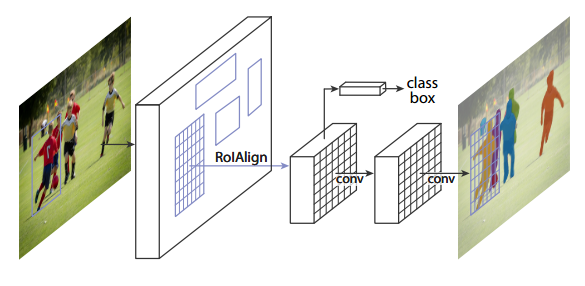
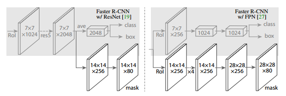
- **RoIAlign layer** eliminates the harsh quantization of RoIPool which leads to minor translation and misalignment. Instead it calculates the exact value of the input features at four regularly sampled locations in each RoI bin, and aggregate the result (using max or average which turned out to be largely the same)
- Loss function
	- Multi-task loss on each sampled RoI 
	\\[
	L = L_{cls} + L_{box} + L_{mask}
	\\]
	- For each ROI, a binary object mask for each class independently. This allows the network to generate mask for each class without competition with other classes and thus **decouples** mask and class prediction.
	- This is in stark contrast with FCN which generally predicts per-pixel multi-class categorization. The latter approach performs poorly in instance segmentation.
	- $L_{mask}$ is defined as the average binary cross-entropy loss after applying a per-pixel sigmoid on each class. 
	- The mask branch predicts an $m \times m$ mask from each ROI using an FCN. Compared to FC layers to predict mask, it requires fewer parameters and is more accurate. 
	- For RoI associated with GT class-k, $L_{mask}$ is only defined on k-th mask.
- Inference
	- The $m \times m$ mask is resized to ROI size and binarized at a threshold of 0.5.
- Benchmark
	- COCO dataset and Cityscape dataset
 	- Mask R-CNN can be minimally modified for human pose estimation (each human key point as a one-hot mask)
 	- Cityscape dataset is more limited and thus demonstrates prediction models' *low shot* learning performance (the ability to learn from very few examples). The study also suggest a *domain shift* (mismatch of distribution) between the val and test datasets. 
- **Ablation test** demonstrate the robustness and analyzes the effects of core factors
	- More powerful backbone leads to better performance. **ResNeXt 101 + FPN** is the most effective network architecture for instance segmentation
	- Class-specific independent masks with sigmoid is more effective as multinomial masks. This decouples classification with segmentation.
	- A single class-agnostic mask is nearly as effective as class-specific masks. Again this demonstrates the effective decoupling of classification and segmentation.
	- RoIAlign layer is critical for successful pixel level localization, including masks and keypoints.
	- Training on a multi-task loss function generally helps all tasks. This means the system can leverage labeled information from multiple tasks. Learning jointly enables a unified system to efficiently predict all outputs simultaneously.
- [Tidbits] 
	- Mask R-CNN system can be quickly prototyped within a day
	- Multi-scale training (on randomly resized images) to reduce overfitting (pre-training backbone also helps) but inference is only on the original scale.
	- Use [Juxtapose JS](https://juxtapose.knightlab.com/) to showcase image segmentation results on websites.

### Polygon RNN (2017 CVPR)
- [Annotating Object Instances with a Polygon-RNN](https://arxiv.org/abs/1704.05548)
- Polygon RNN treats segmentation not as a **pixel-classification** problem but rather a **polygon prediction** task, mimicking how most of current datasets have been labelled. 
	- Semi-automated image annotation system, allowing human to interfere at anytime to correct a vertex if needed.
	- It helps to reduce the cost of the expensive data labeling for instance segmentation.
- Architecture:
	- CNN + RNN
	- CNN backbone is VGG with skip connections (similar to SharpMask). Input is the bounding box around an object. Add 3x3 conv layers (with necessary bilinear upscaling or max-pooling) on top of the skip layers to form a concatenated feature (28 x 28 x 512 as shown)
	- RNN is used to process the sequence of 2D polygon vertices (clockwise order) as time-series data. 
	- The architecture of the RNN is a **Convolutional LSTM**, used as a decoder. ConvLSTM operates in 2D to preserve the spatial information from CNN. It uses convolutions to replace a FC RNN, reducing the parameter count and calculation cost.
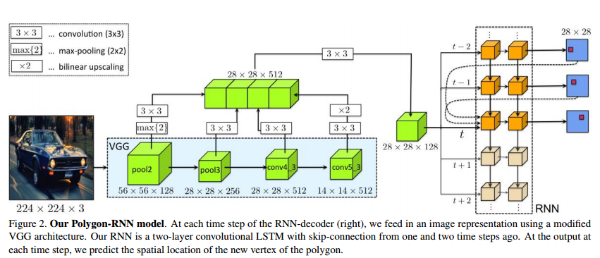
- LSTM
	- Each cell has **3 gates**: the input gate $i_t$, forget gate $f_i$, output gate $o_t$, and **3 states**: a cell state $c_t$, input state $x_t$, output value $h_t$ (also called hidden state), and **1 (intermediate) block input value**: new info to update cell state $g_t$.
	- For detailed introduction, refer to [Chris Olah's blog post](http://colah.github.io/posts/2015-08-Understanding-LSTMs/) and [this review](https://arxiv.org/pdf/1503.04069.pdf)

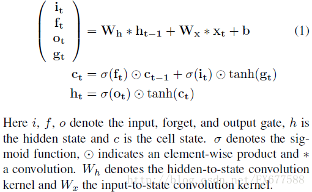
	- The input at any time t is the output from two previous time steps ($y_{t-1}$ and $y_{t-2}$) and the first time step ($y_1$). The past two points to follow a particular orientation of the polygon, and the first vertex to help decide when to close the polygon.
	- The output at any time t is a $D \times D + 1$ grid, $D \times D$ is the one-hot encoded 2D position of the vertex, and one additional value is the end-of-sequence token.
- Training
	- End-to-end training of CNN + RNN
	- Cross-entropy loss summed over 2D space, with target distribution smoothed.
	- Beyond normal data augmentation, randomly select the starting vertex of the polygon annotation.
	- The **first vertex** is predicted differently by purely training a CNN (backbone VGG + two additional layer), on a multitask loss (is the pixel on the border, is it a vertex).
- Inference (with annotators in the loop)
	- Taking the vertex with the highest log prob
	- The model can run on a prediction mode without any input from the annotator. It can also accept online correction from a **simulated annotator** when the prediction deviates from the GT more than a preset threshold.  
- Benchmark:
	- The speedup benchmark is based on the number of clicks required to generate the polygon mask.
	- Limitation: the simulated annotator always feeds GT to the polygon RNN, i.e., the ideal situation, which a real annotator may not achieve.
- [tidbits] How to use deconv to represent bilinear upsampling?

