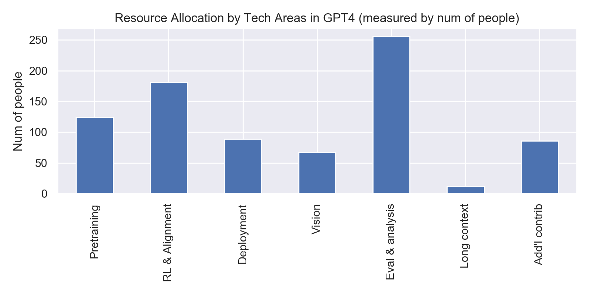
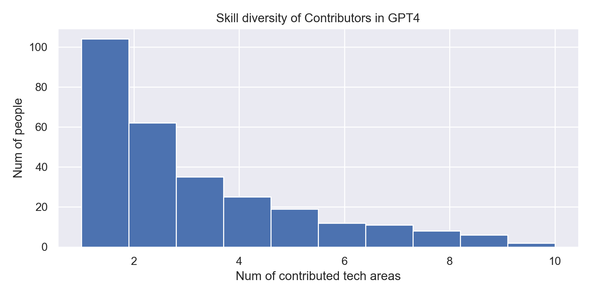
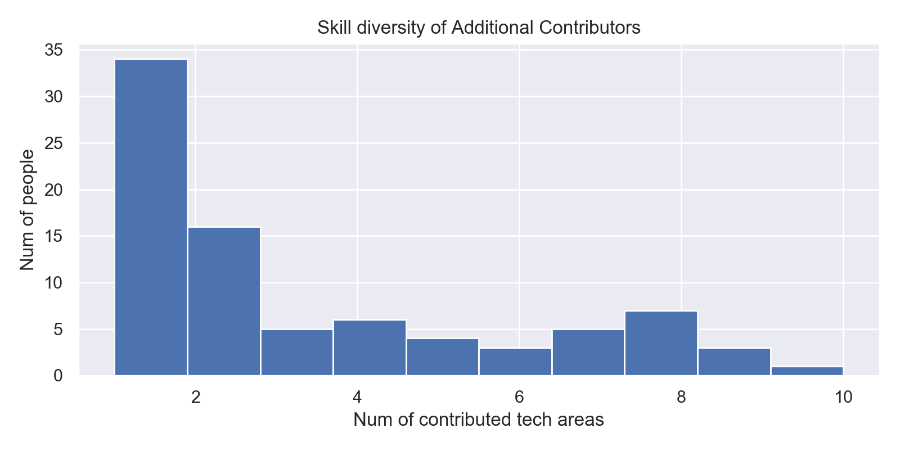
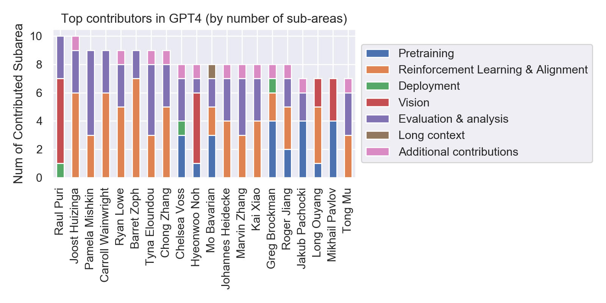
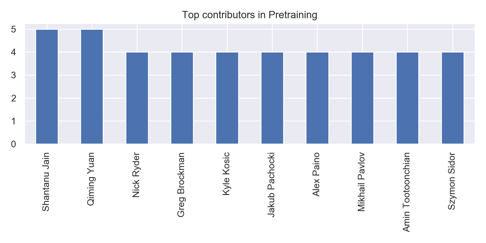
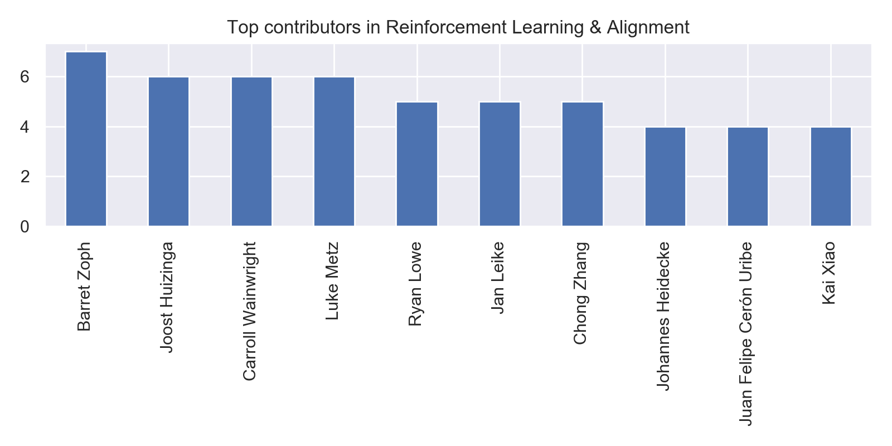
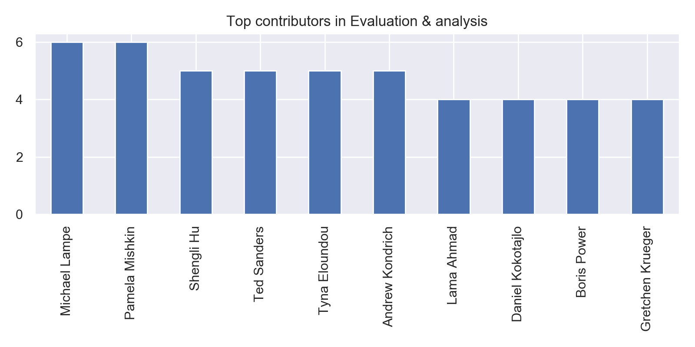
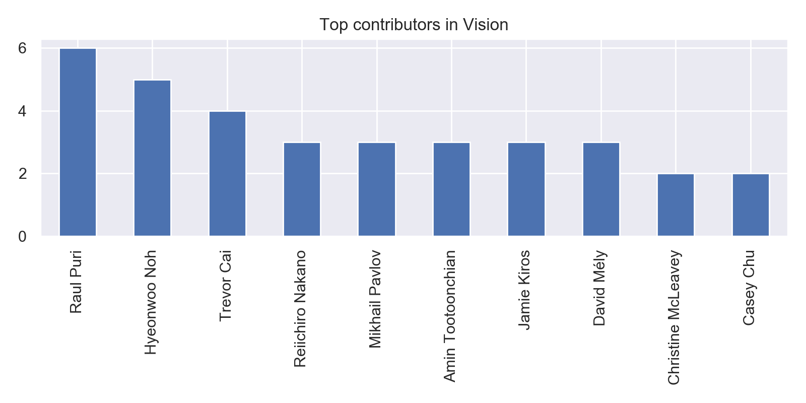
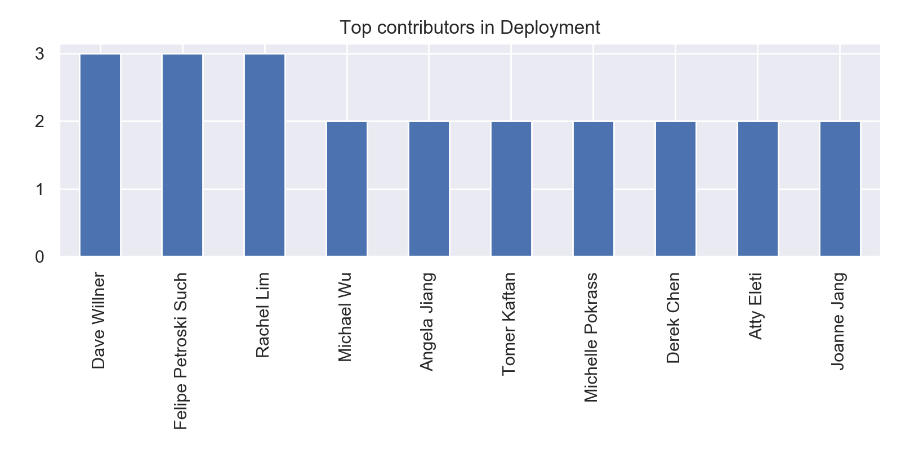

# Glimpse into OpenAI Org from GPT4

*03/19/2023*

Open AI recently released the [Tech Report for GPT4](../paper_notes/gpt4.md). It has a lengthy list of authors. It revealed interesting facts in the development in GPT4.

The organized org chart in text format can be found [here](./openai_orgchart.txt). The jupyter notebook used to perform analysis is [here](./openai_orgchart.ipynb). 

In total, there are 815 head counts across all tech areas, and there are 284 unique names in the appendix. 

## Resource Allocation

The technical areas can be largely grouped into the following categories:

- 'Pretraining' (large scale pretraining)
- 'Reinforcement Learning & Alignment' (post training alignment)
- 'Vision' (account for multimodality of GPT4, as compared to predecessors)
- 'Evaluation & analysis' (eval, the meat of this [tech report](../paper_notes/gpt4.md))
- 'Deployment'
- 'Long context'
- 'Additional contributions' (typically non-tech areas, such as paper writing)

GPT4 is heavily invested in evaluation and results analysis. 

## Skill Diversity

As we mentioned above, there are 815 head counts across all tech areas, and there are 284 unique names in the appendix. That means, the GPT4 team member typically wears multiple hats, reflecting the typical work pattern in start-ups. On average, each team member wears 2.87 hats.

It seems that people wearing multiple hats tend to contribute more to additional non-tech areas. More than 69% of people (11 out of 16) who contributed to more than 8 areas also contributed to the additional non-tech areas.

## Top contributors

Now let's look at the top contributors by the number of tech areas they contributed to. 

And we can also see the top contributors by subareas.

