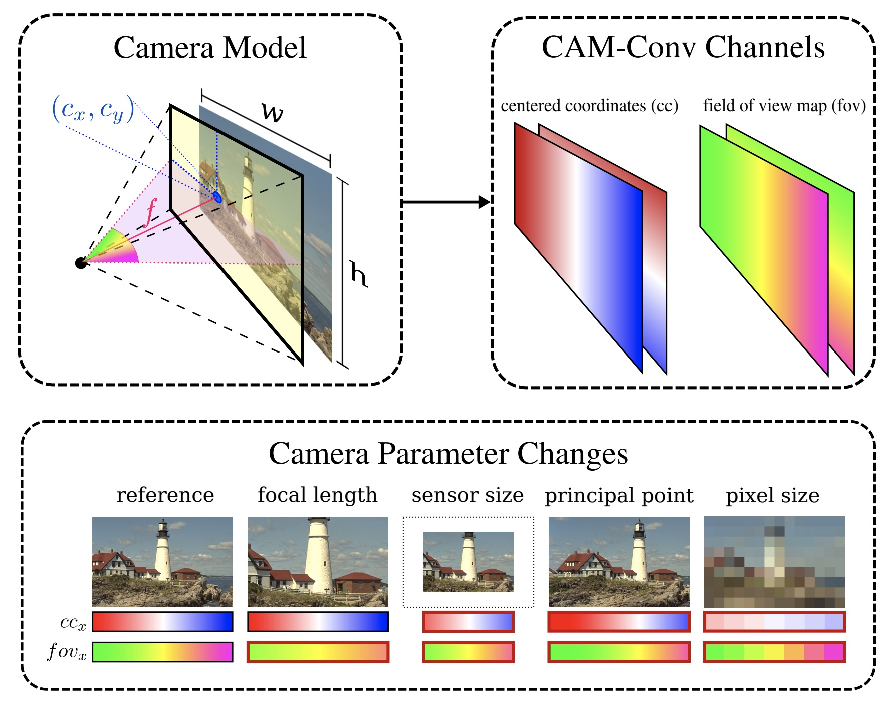

# [CAM-Convs: Camera-Aware Multi-Scale Convolutions for Single-View Depth](https://arxiv.org/abs/1904.02028)

_November 2019_

tl;dr: Extension of coordConv to make DL perception model invariant to cameras.

#### Overall impression
Usually models are **overfitted to a benchmark**, with train/test data from the same camera. The generalization to an unseen camera (with unseen sensor size and intrinsics) is poor. This prevents us from using data taken from other cameras to train the data-hungry deep learning model.

The idea is quite clever in how to embed/encode the sensor size (pixel number format) and focal length into convolution.

Embedding meta data info into conv:

- [meta data fusion for TL2LA](deep_lane_association.md)
- [fusing radar pins with camera](distant_object_radar.md)
- [cam conv](cam_conv.md) to fuse focal length into convs.
- [camera radar fusion net](crf_net.md)

The basic idea is to convert meta data into pseudo-images suitable for CNNs. Cam conv precomputes pixel wise coord map and fov maps and concat them to original input.

#### Key ideas
- Centered coordinates map, coordConv - cx
- FoV map: ccm with focal length np.atan(ccx/fx). As long as the FoV is the same, the FoV map extent is the same. (see fig below)
- Normalized coord map: coordConv normed to [-1, 1]

- Focal length normalization: 
	- During training, normlize distance target to a nominal distance
	- It can help CAM Conv converge faster
	- It assumes a fixed pixel size over the whole image set --> Why?

#### Technical details
- Main findings:
	- Single focal length/image size training overfits
	- More context helps
	- Cam conv generalize to cameras unseen during training
	- Using cam conv and multiple training datasets and then deploy on target test set, performs better than training and testing on the test set.

#### Notes
- [code in keras](https://github.com/jmfacil/camconvs/blob/master/python/CAM/blocks/camconvs_keras.py)
- [CVPR 2019 Poster](https://lmb.informatik.uni-freiburg.de/Publications/2019/ZUB19/poster-camconvs.pdf)
- The idea of normalizing to image plane at z = 1 to generalize among diff cameras can be also seen in [monoloco](monoloco.md). --> How is this compared to cam conv?
- The findings are in the context of depth prediction, which focal length has a huge impact on. However it is unclear how this would impact object detection. COCO should have been collected on numerous cameras.
- Can we marry two cameras with two focal lengths to predict depth? To extend [Tele Wide Stereo Matching](twsm_net.md).