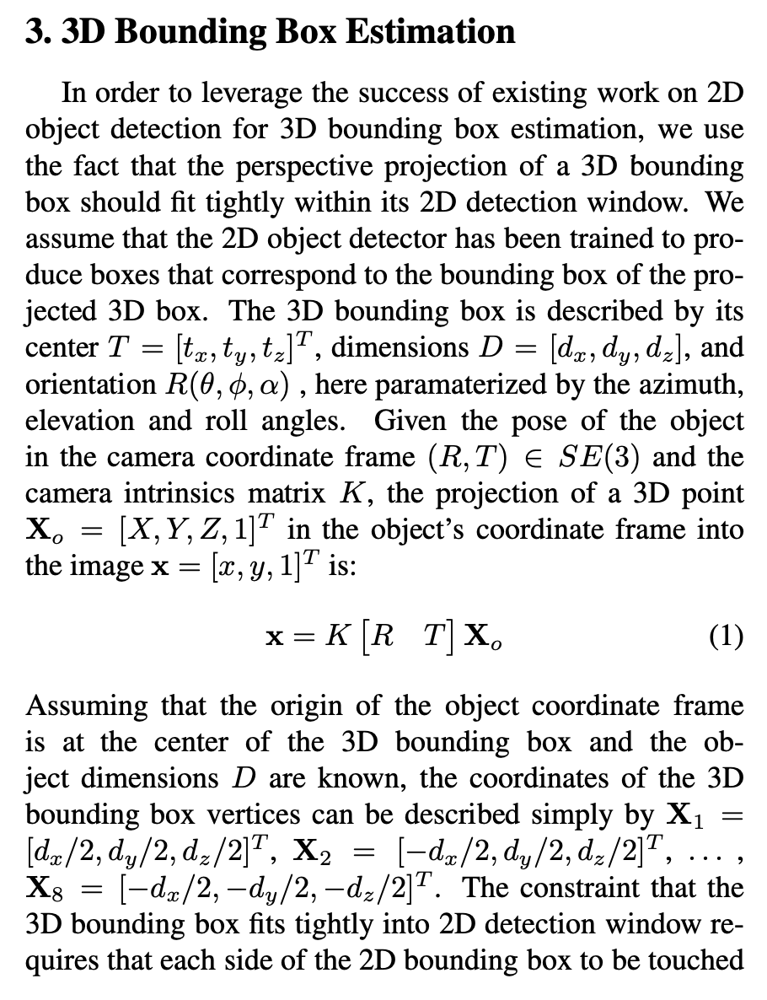
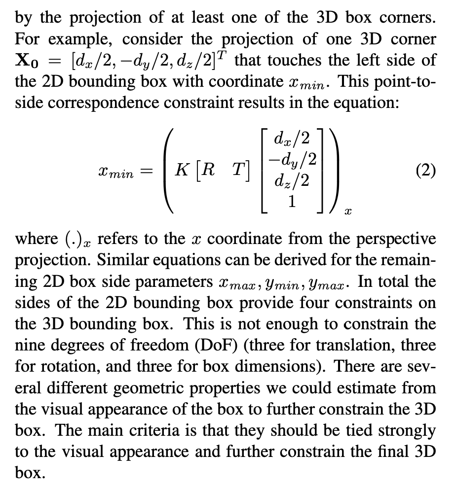
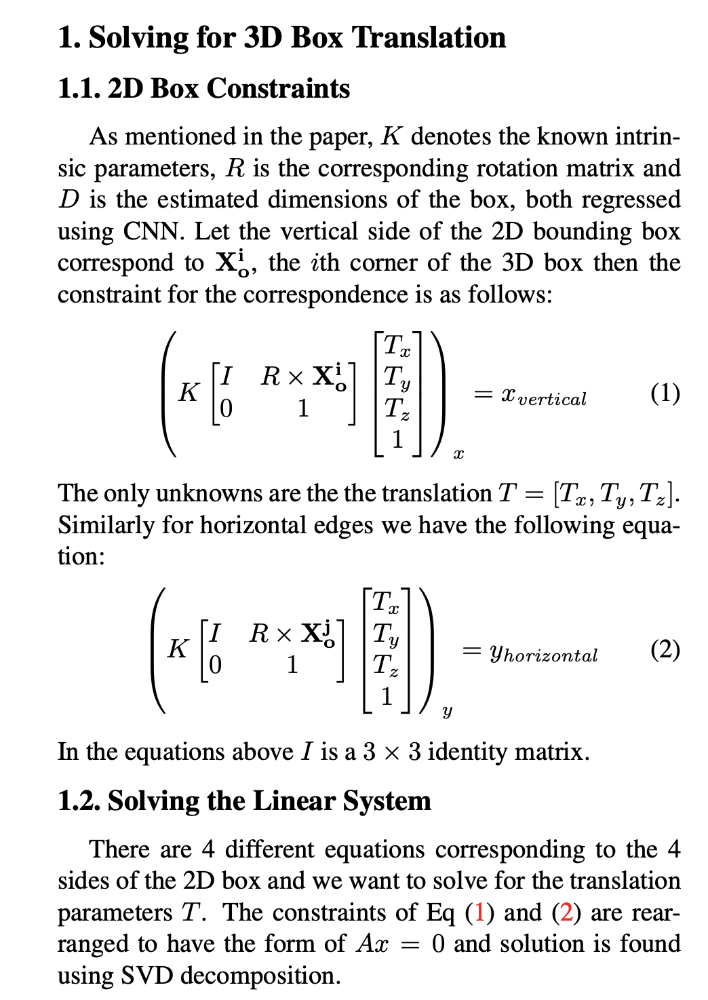
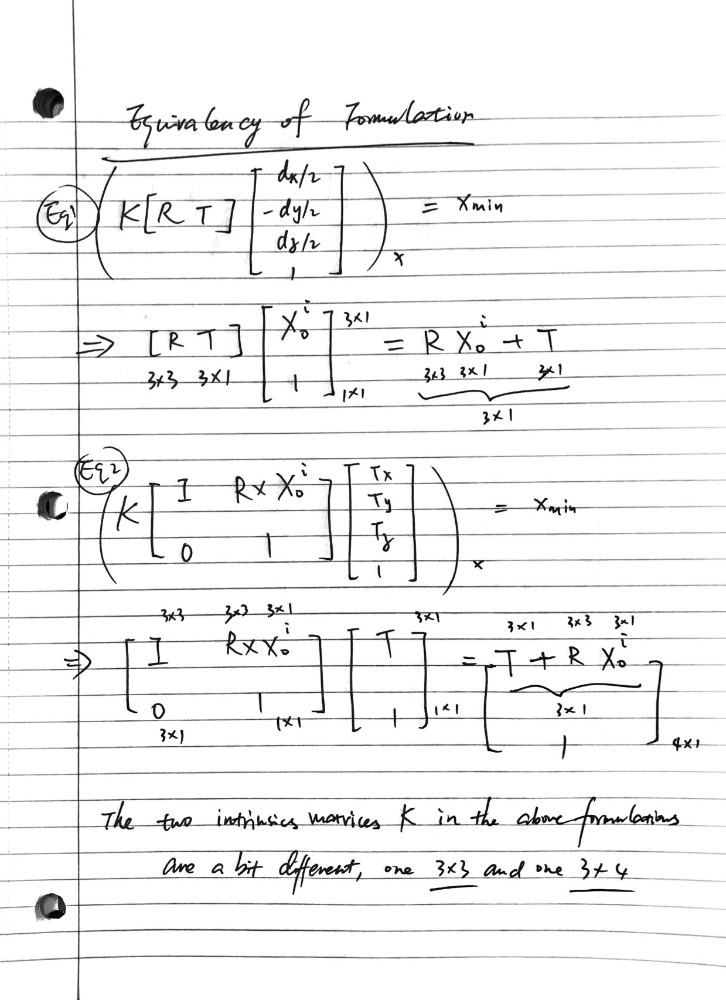
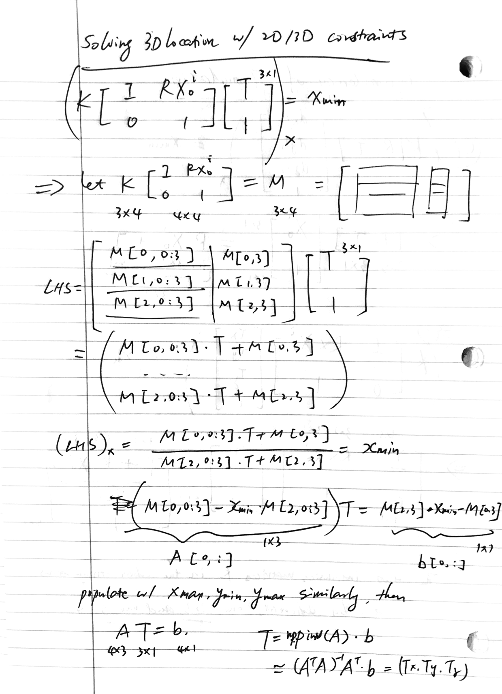
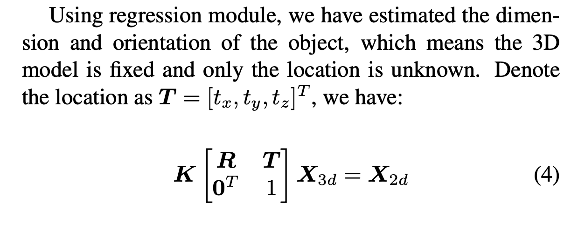
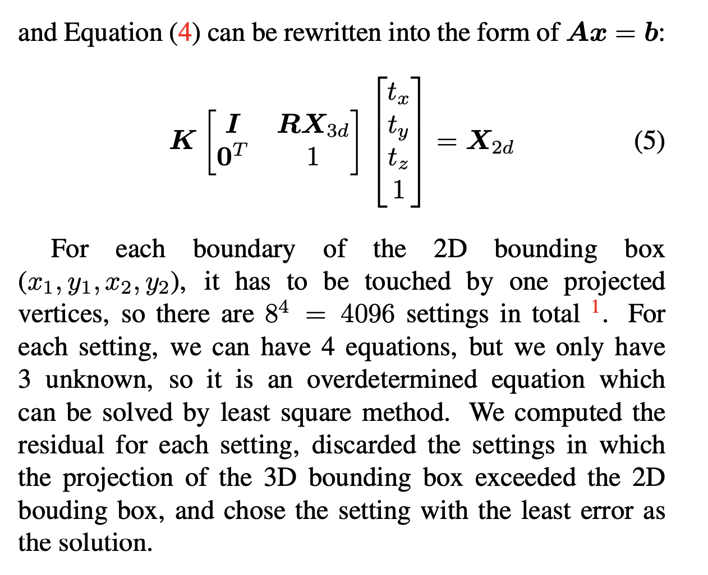
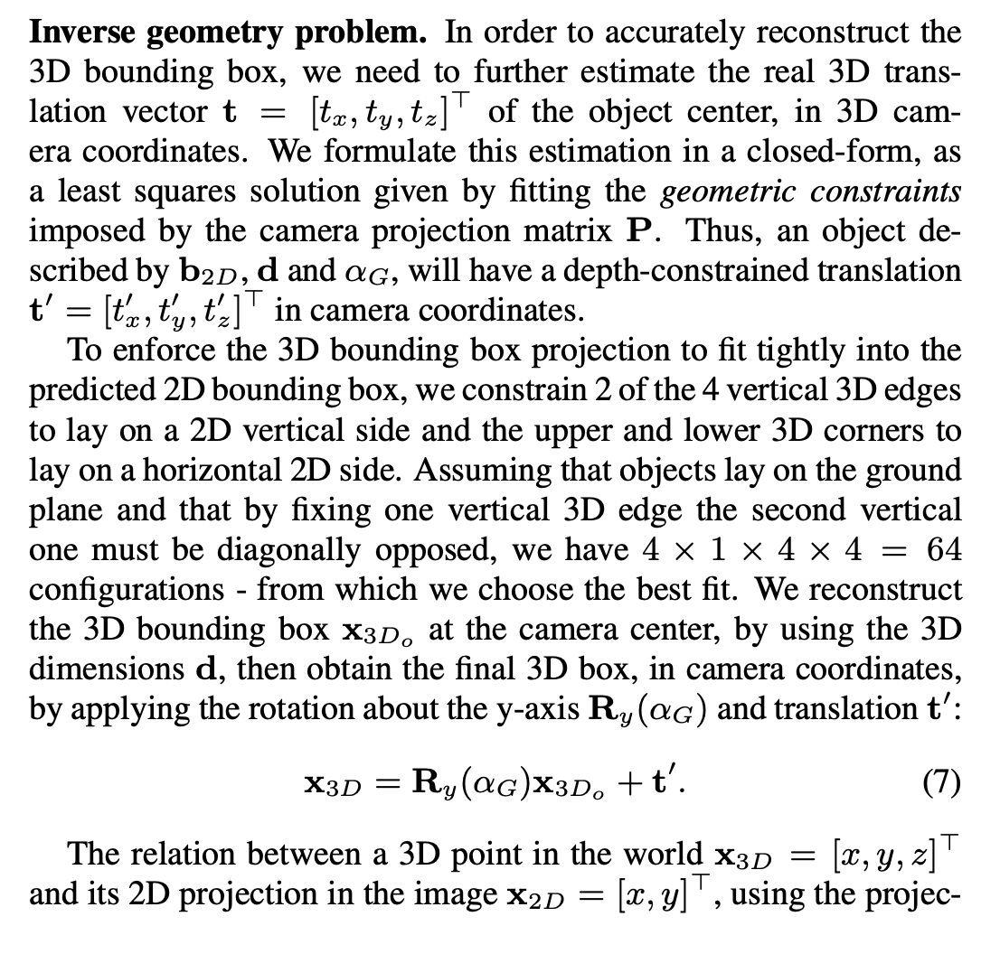
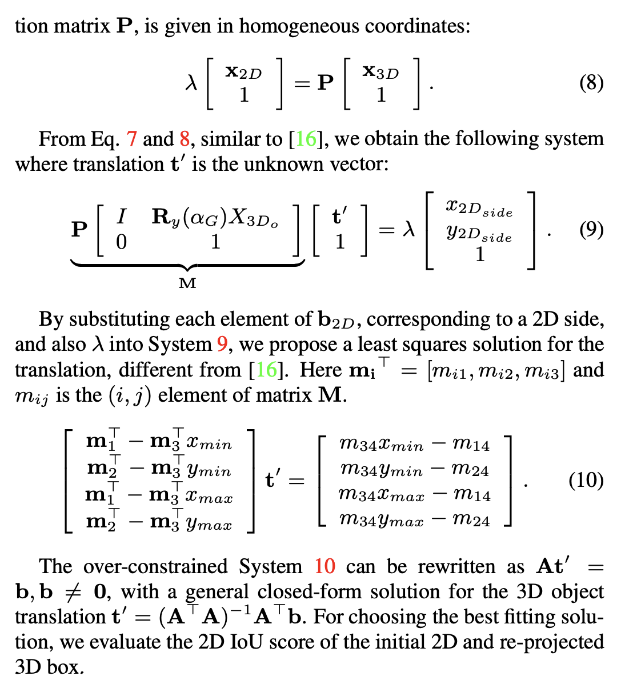

# 2D 3D contraints in Mono 3DOD

_October 2019_

tl;dr: Summary of the main idea.

### Deep 3D Box
from [Deep3DBox](https://arxiv.org/pdf/1612.00496.pdf) and its [Supplementary material](https://cs.gmu.edu/~amousavi/papers/3D-Deepbox-Supplementary.pdf), and [review in 中文](https://blog.csdn.net/qq_29462849/article/details/91314777)

#### Code 
[2d 3d contraint code](https://github.com/lzccccc/3d-bounding-box-estimation-for-autonomous-driving/blob/master/utils/correspondece_constraint.py)
[64 configuration](https://github.com/skhadem/3D-BoundingBox/blob/master/library/Math.py)

### FQNet
from [FQNet supplementatry material](https://arxiv.org/pdf/1904.12681.pdf)

### Shift RCNN
from [shift rcnn](https://arxiv.org/pdf/1905.09970.pdf)

