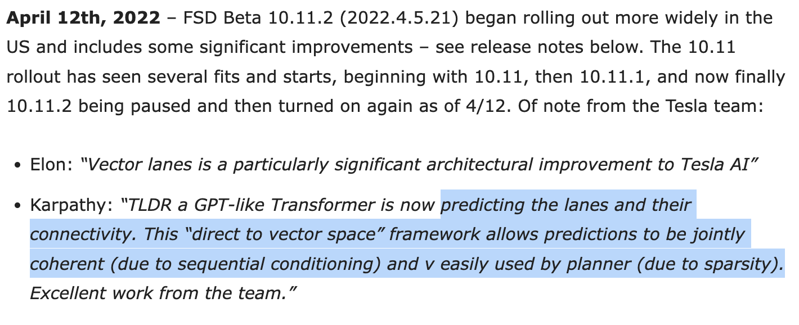

# [PersFormer: 3D Lane Detection via Perspective Transformer and the OpenLane Benchmark](https://arxiv.org/abs/2203.11089)

_July 2022_

tl;dr: Joint 2D and 3D lane line detection with transformer. 

#### Overall impression
The paper seems to largely follow the idea of [BEVFormer](bevformer.md) and share many authors, but interestingly did not cite it. 

**3D lane line vs BEV lane line**: The problem formulation of 3D Lane line detection is to predict 3D lane line (and 2D as well) in front of ego from a single onboard camera. It is a bit different from the recent wave of BEV static road structure detection (such as [HDMapNet](hdmapnet.md)), which targets to predict 360 deg lane line from multiple onboard cameras. --> This is one area I see gaps and would be great to come up with a unified metric to benchmark both tasks.

**Two ways to do structured lane line detection**: one is top-down approach through anchors ([PerFormer](persformer.md)), and the other is bottom up approach but with polyline decoders. ([VectorHDMapNet](vectorhdmapnet.md)). However, how the anchor based method handles intersection is still not clear. The bottom up method seems to be much more flexible method. Yet the bottom-up approach extensively depends on the accuracy of binary segmentation in the first stage, where it would fail in some scenarios such as extreme weather or lighting conditions. Tesla's method used to be bottom-up (bag of points) and recently got switched to direct to vector space in a recent release (beta 10.11.2).

The paper also proposed a new dataset (OpenLane) on top of Waymo Open dataset. This is quite a significant contribution to the community. Not sure how Waymo dataset organizers would react to it though :) I would love to see this to be officially incorporated into Waymo dataset as one official competition track (if Waymo allows the annotation of the reserved test dataset).

The engineering work seems quite solid, but the writing of this paper needs some improvement.

#### Key ideas
- The gap between 2D lane line detection and 3D application is typically bridged by the planner assumption. However it does not hold true in most autonomous driving scenario (uphill, downhill, bump, etc).
- PersFormer: adopts a unified 2D/3D anchor design and an auxiliary task to detect 2D/3D lane(line)s simultaneously, enhancing the feature consistency and sharing the benefits of multi-task learning.
- The Perspective Transformer learns the inverse perspective mapping from front view to BEV. This is very much similar to [BEVFormer](bevformer.md). The PersFormer seems to fix the reference point to the ground (setting z=0).
- OpenLane
	- Annotated with 2D and 3D lidar point cloud. Visibility is labeled in each image. It annotates visibility per image, and seems to be much more refined than the autoLabel method with Hd map (in nuscenes dataset).
	- Scene tags
		- weather: clear, partly cloudy, overcast, rainy and foggy.
		- scene/location: residential, urban, suburbs, highway, parking lot
		- hours: daytime, night, dawnm
	- Scenario set: up/down, curve, extreme weather, night, intersection, merge/split

#### Technical details
- Actually what the paper detects is not "3D lane" but rather "3D lane line". Lane is an even higher level concept, with each lane associated with multiple lane lines.
- PersFormer also proposed an interesting idea of **CIPO (closest-in-path object)**. Although not directly related to lane line detection, this is quite practical in autonomous driving.
- Anchor design: front, arctan(2), arctan(1), arctan(0.5). Project 3D anchors to 2D. 
- BEV spae is 20m x 100m, in front of the ego car. 
- Questions
	- How does the joint 2d/3d annotation work?
	- For each lane line instance, is the best 2D anchor and 3D anchor selected separately or jointly? More details regarding the anchor selection would be ideal.
	- Page 8: Given a query point (x,y) in the target BEV map, we project to the corresponding point in front view using IPM equation. --> This step is not IPM (2d to 3d), but just reprojection to perspective image (3d to 2d).
	- Page 16: new anchor design: what is new anchor design?
	- How does the anchor handle horizontal cases? There is a special handling in the postprocessing of labels in Fig. 14, but how to handle such scenarios online is not mentioned. 
	- What is the diff between scenario sets (Page 13) and scene tags (Page 26, Table 7)?
- Typos
	- Page 10: approximately longitudinal along x-axis --> laterally along x-axis. 
	- Page 7: referred to as LaneATT --> borrowed from
	- Page 26: statics --> statistics
	- Page 29: partly cloud --> partly cloudy

#### Notes
- [OpenLane Dataset](https://github.com/OpenPerceptionX/OpenLane)
- [PersFormer code](https://github.com/OpenPerceptionX/PersFormer_3DLane)