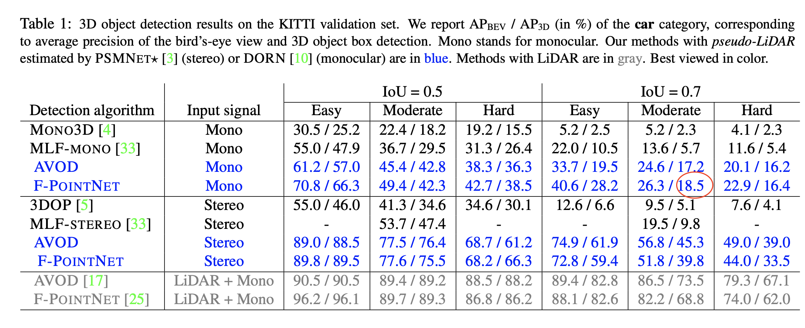
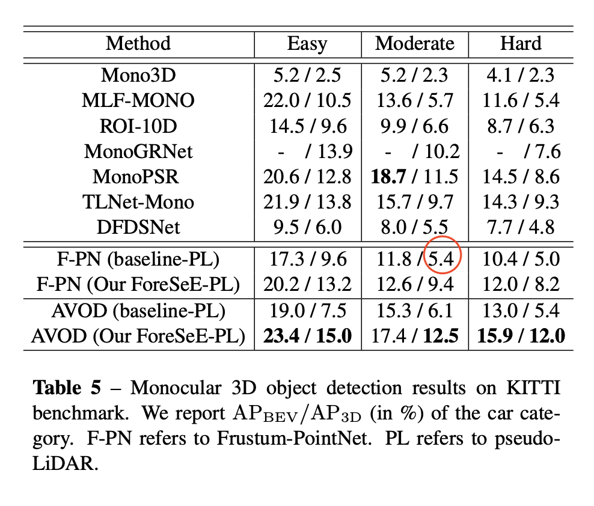

# [Pseudo-LiDAR from Visual Depth Estimation: Bridging the Gap in 3D Object Detection for Autonomous Driving](https://arxiv.org/pdf/1812.07179.pdf)

_Mar 2019_

tl;dr: Estimate depth map from RGB image (mono/stereo) and use it to lift RGB to point cloud. The point cloud representation uses depth information more efficiently and steps toward bridging the gap between camera based approach and lidar based approach.

#### Overall impression
This paper opens up a brand new field for camera perception. It points out that the current inefficiency in 3D object detection based on RGB/D image. This idea is highly thought-provoking and we can build upon this idea for new types of hardware setup for autonomous driving. This work seems to be inspired by [MLF](mlf.md) based on mono images.

The Uber ATG group also publishes several papers ([ContFuse](contfuse.md), [MMF](mmf.md)) on this idea, although not as explicit as the pseudo-lidar paper or this one.

**Note that DORN's training data overlaps with object detection's validation data, and suffers from overfitting.** Both [pseudo lidar](pseudo_lidar.md) and [pseudo lidar e2e](pseudo_lidar_e2e.md) suffer from this problem. According to the [ForeSeE](foresee_mono3dod.md) paper, if the validation data is excluded from the training of depth map, then PL's performance drops from 18.5 to 5.4 AP_3D at IoU=0.7.

In [refined Monocular PseudoLidar](refined_mpl.md), the authors sparsified the dense pseudo-lidar point cloud for faster processing, and gained accuracy as well.

#### Key ideas
- Use cheaper monocular or stereo image data to reconstruct expensive lidar data. It would be a good idea to have something to fall back onto in case of an outage.
- The depth map from stereo images actually align really well with real lidar, but from mono images are not.
- Advantages of point cloud representation: distance invariant, pixels that are grouped together in 2D image could be far away in 3D, which contradicts the fundamental assumption of 2D conv.
- If only one view is used, BEV generates much better results than FV. 

#### Technical details
- Error of depth estimation grows quadratically with the depth of an object for stereo-based approaches, whereas it scales almost linearly for time of flight approaches.
- The best monocular depth estimator is [DORN](https://arxiv.org/pdf/1806.02446.pdf), and the best stereo depth estimator is [PSMNet](https://arxiv.org/pdf/1803.08669.pdf).
- [MLF](mlf.md) also estimates a depth map, but it is just concatenated to the RGB image as a depth map and is not as effective as projecting depth map to 3D maps. So yes, **representation matters**.

#### Notes
- Instead of stereo camera, we can use a cheap lidar (maybe one or two lines) or a radar sensor.
- There are > 100,000 points in a lidar scene, but the points are distributed along a few horizontal beams, sparsely occupying the 3D space. The pseudo-lidar is generally more dense than lidar data.
- For hard examples (generally farther away), the performance gap between camera-based approach and lidar-based approach is huge. **Note**: This calls for more accurate depth estimation from lidar or radar data. In particular, in the pseudo-lidar image from mono images in Fig. 7, there are a lot of missing detections.
- The conversion from depth map to pseudo-lidar is very fast, and the main task of his work and future work seems to be how to get an accurate estimation of depth map. Using radar or cheap lidar will definitely help.
- The current work can be **improved** in the following ways:
	- Mono image performance lags behind stereo, and intro of lidar/radar will boost mono performnace.
	- Even for stereo, objects further than 30m will have large errors. Objects out of this range is arguably not as important as those in this "strong-interaction zone", but it would be of interest to improve the detection performance in the difficult (farthest) strata.