#[2023/05] State of GPT

+------------------------------------------------------------+
| By Andrej Karpathy                                         |
|                                                            |
| https://www.youtube.com/watch?v=bZQun8Y4L2A                |
|                                                            |
| How to train your ChatGPT assistant \-- An emerging recipe |
+------------------------------------------------------------+

# Opening/Ending Remarks by GPT
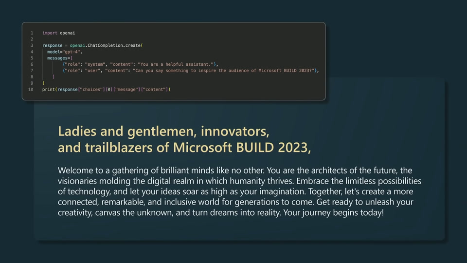

# Basic knowledge of GPT

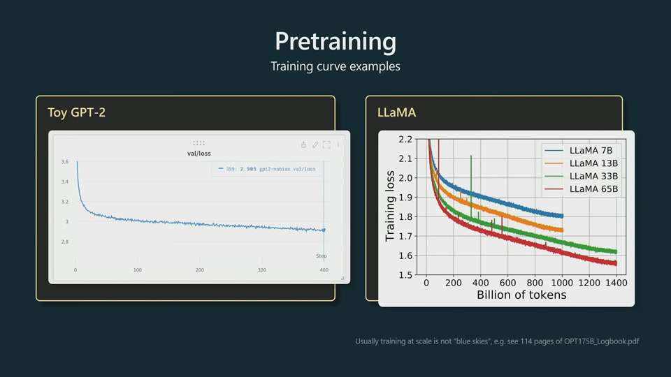

LLaMA is a significantly more powerful model than GPT-3. LLaMA has much
fewer parameters, but are trained significantly longer. We should not
judge the power of a model just by the number of parameters.

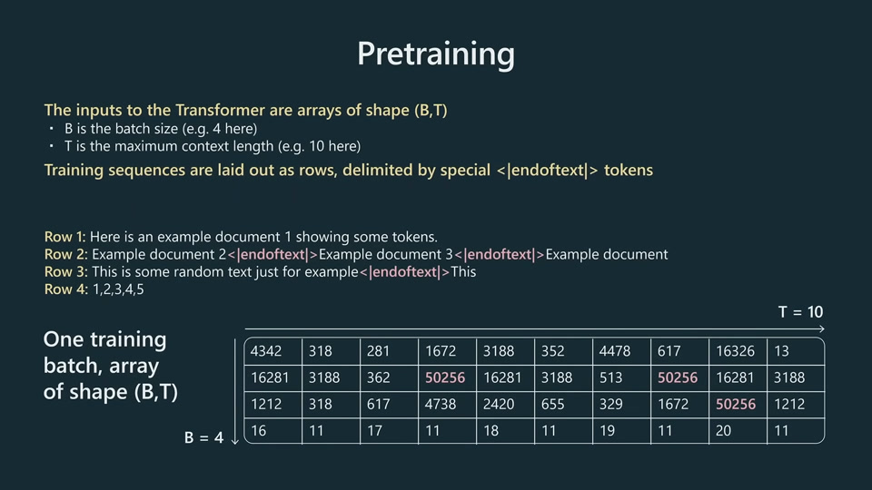

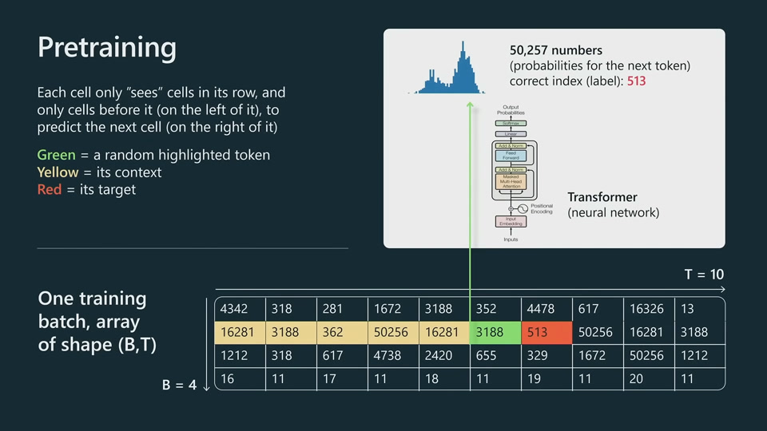

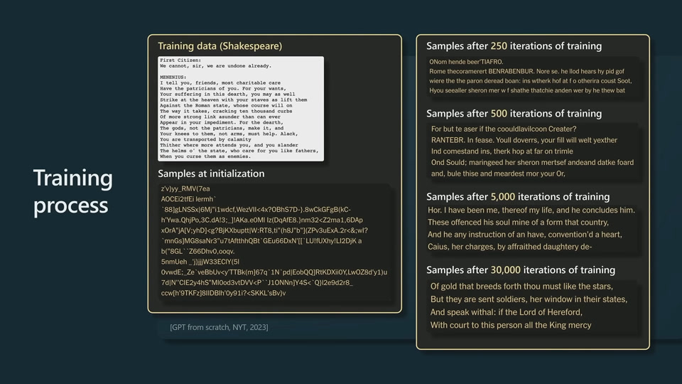

This Shakespeare toy model seems to use letters as tokenization, as many
words are not in standard vocabulary in modern English.

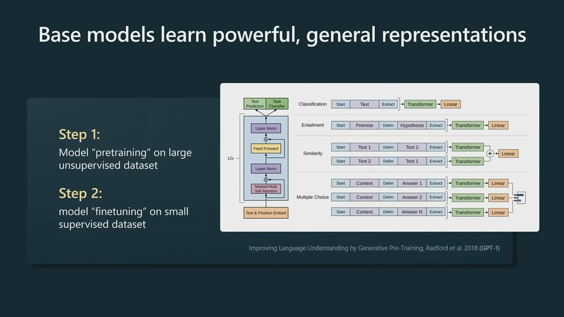

Just in terms of predicting the next token, the model is forced to
understand a lot about the structure of the text and different concepts.

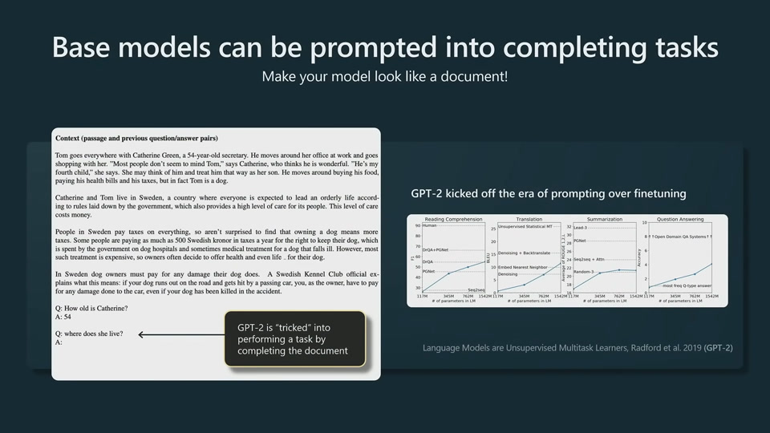

Base model vs Assistant model

GPT4 is a base model. ChatGPT backend is an assistant model.

The best base model available is LLaMA, but not commercially licensed.

Difference between base model and assistant model

Base model are not assistants. They just want to complete documents.

They have to be finetuned into \"assistants\" or promoted carefully.

One example is that, you can directly have a chat with ChatGPT, but you
need to trick (properly prompt) GPT base model to have a conversation
with you.

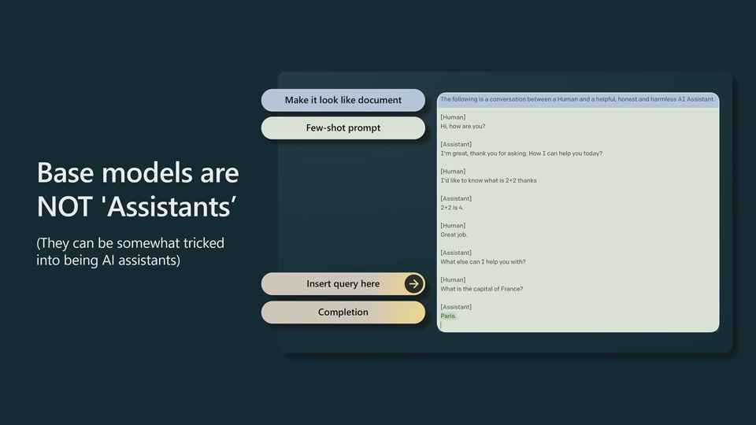

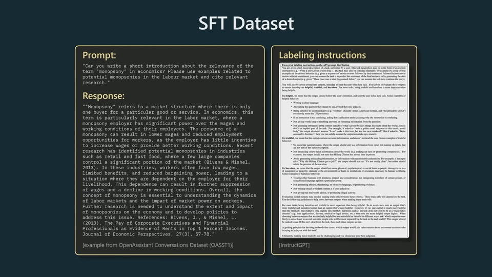

In SFT stage, nothing changed algorithmically. Swap out high quantity,
low quality data and use low quantity high quality data.

ChatGPT is an RLHF model.

Vicuna is an SFT model.

Base models, SFT model and RLHF models can all be deployed.

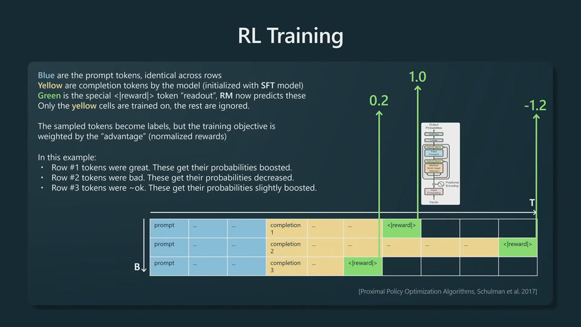

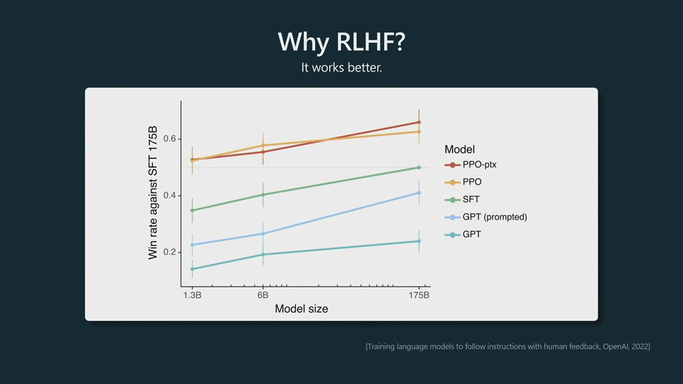

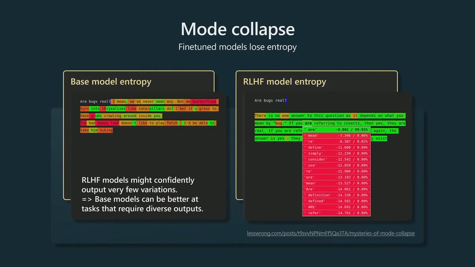

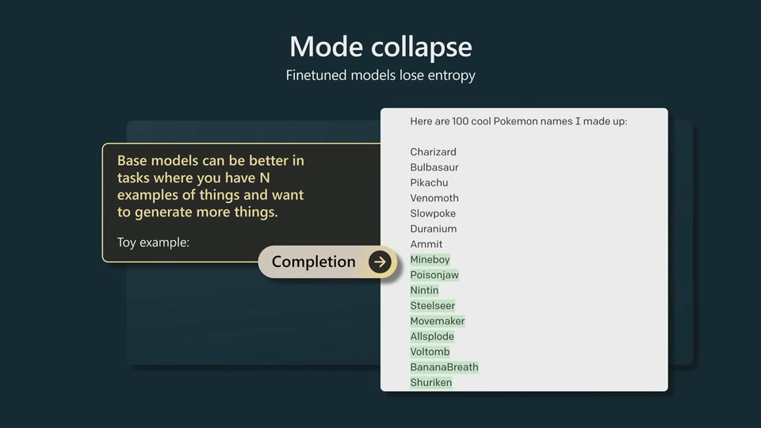

RLHF models are more polite but less creative.

# Applications

LLMs needs tokens to think. Only 80 layers so it cannot handle complex
reasoning. CoT gives LLM a chance to slow down the reasoning process.

LLM get stuck on a bad token and cannot recover. LLMs know when they
perform bad. So we have to make that up in the prompt to give it another
chance to sample and recover.

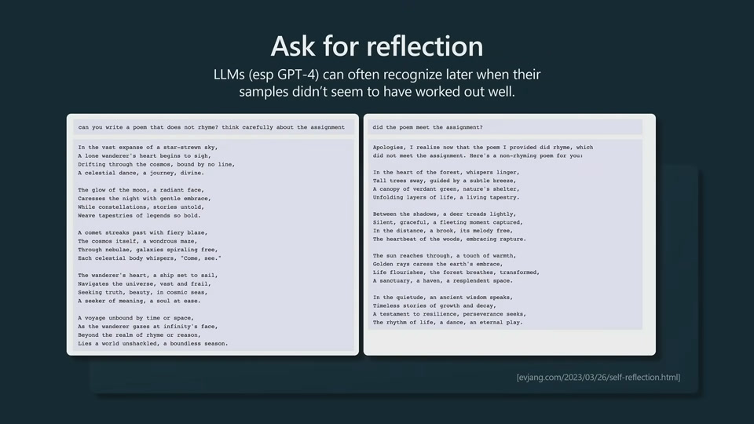

System 1 vs System 2

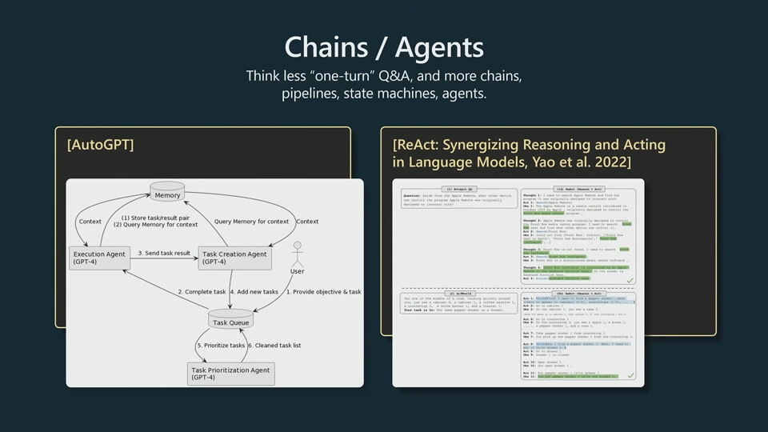

ToT is AlphaGo for text.

LLM does not want to succeed. They want to imitate.

Directly feed relevant information to prompt. Open book test for LLM.

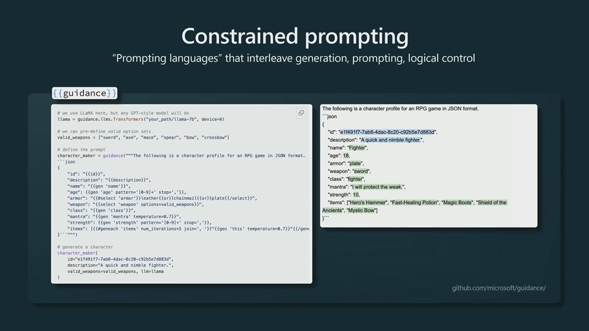

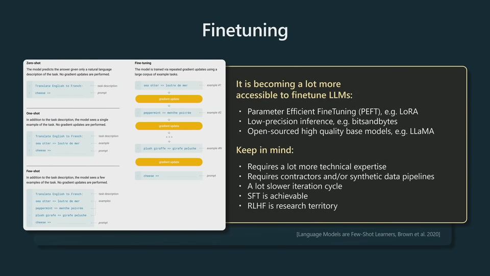

SFT can be done right, but much more involved. RLHF is pretty much
research territory and not practical to do in industry.

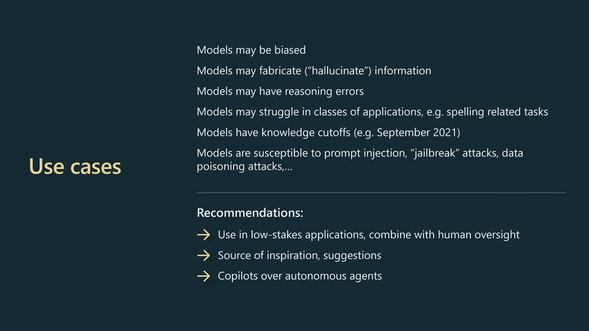

# On Autonomous Driving

* How to tokenize a scene?

* How to sample different trajectories?

See [how to sample a language model](https://towardsdatascience.com/how-to-sample-from-language-models-682bceb97277). Rollout is a random process,
controlled by temperature.

* How to treat nav info?
