# Andrej Karpathy's Talk

## [ICML 2019 (CVPR 2019)](https://www.youtube.com/watch?v=IHH47nZ7FZU)

## [ScaledML 2020](https://www.youtube.com/watch?v=hx7BXih7zx8)

- [Review by 黄浴](https://zhuanlan.zhihu.com/p/136179627)

Stuff that caught my eye:

- Even state-less SOD such as stop signs can be complex
	- active states and modifiers
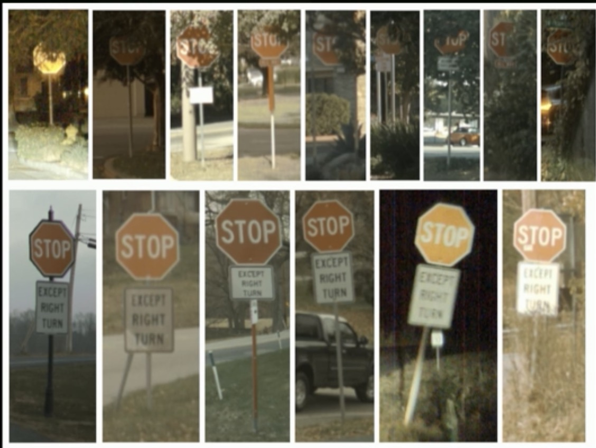
- temporal flickering in shadow mode indicates corner case
- Test driven feature development
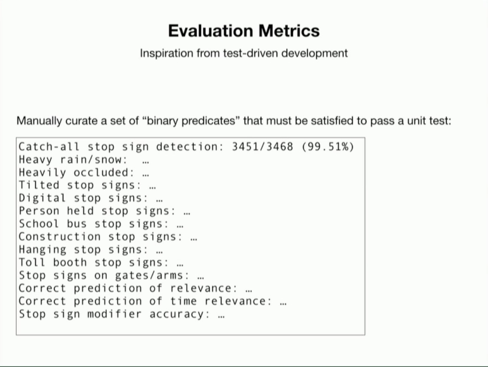
- BEVNet to learn local map from camera images
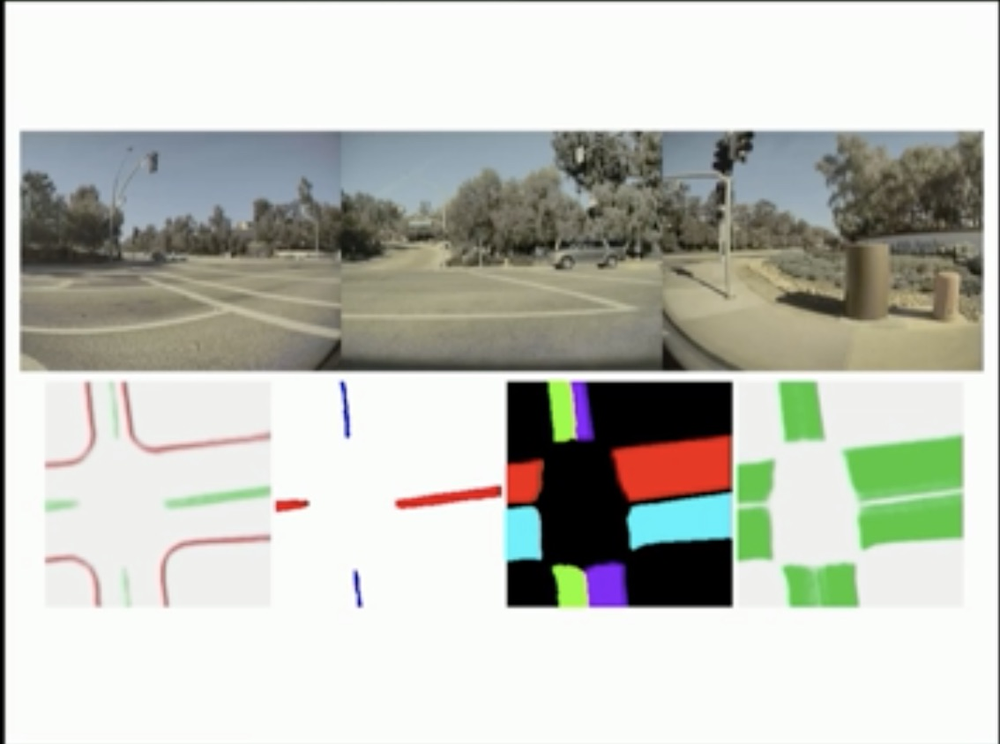
- Pseudo-lidar (Vidar) approach is promising in urban driving (40mx40m range)
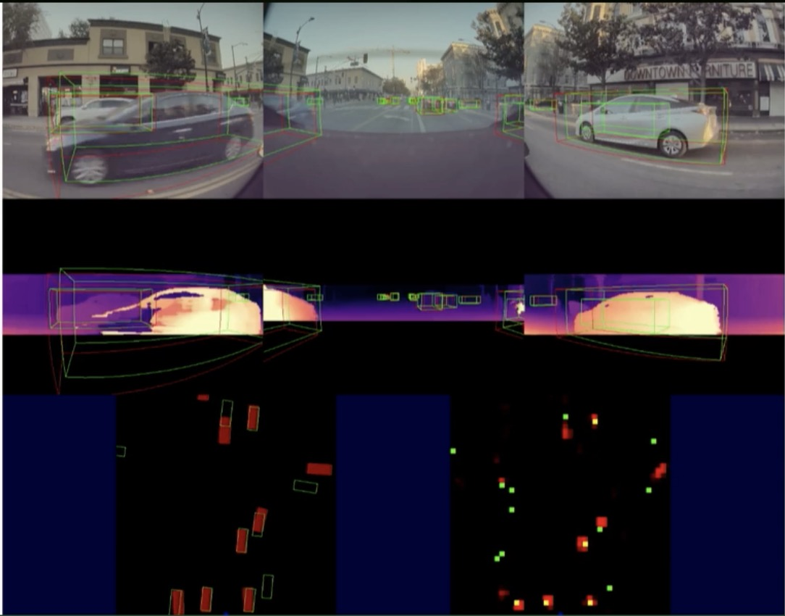
- infrastructure: operational vacation

- Other pics

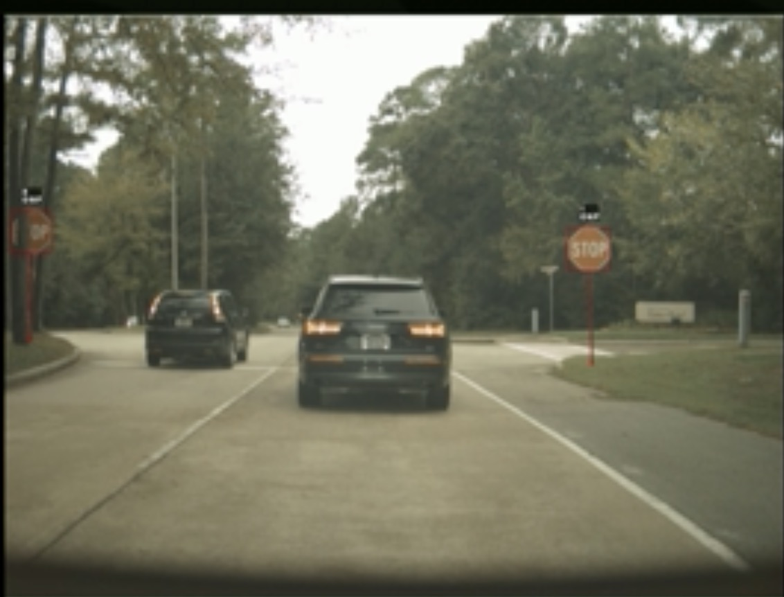
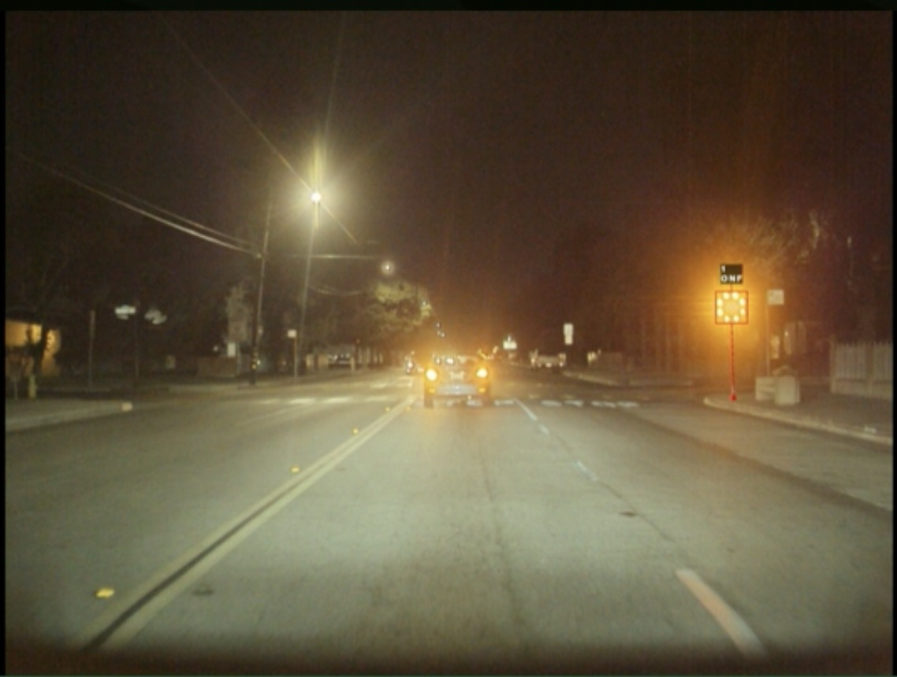

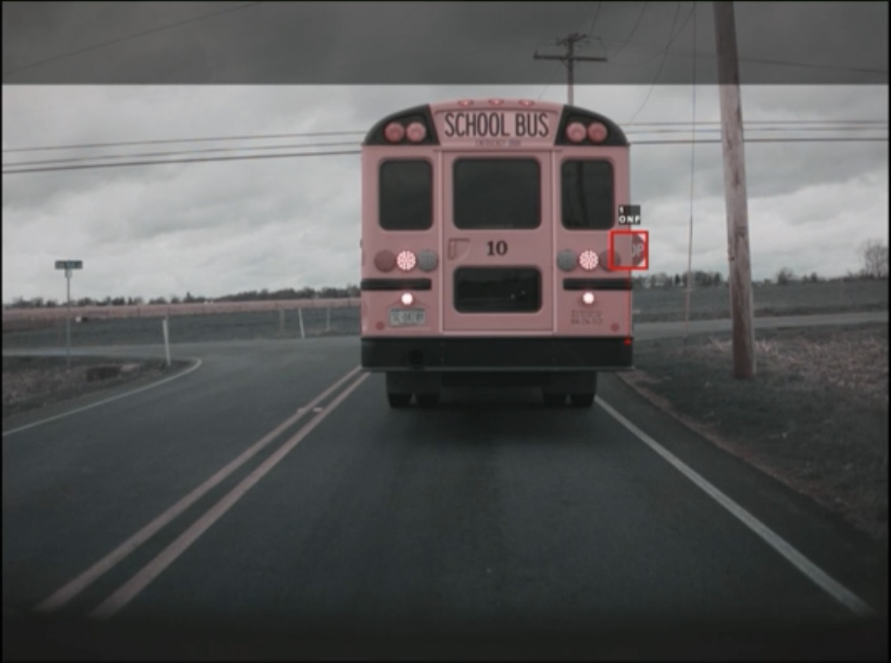

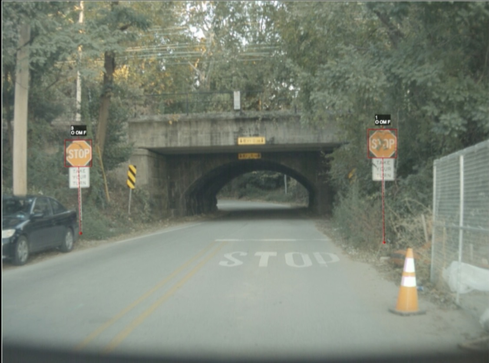
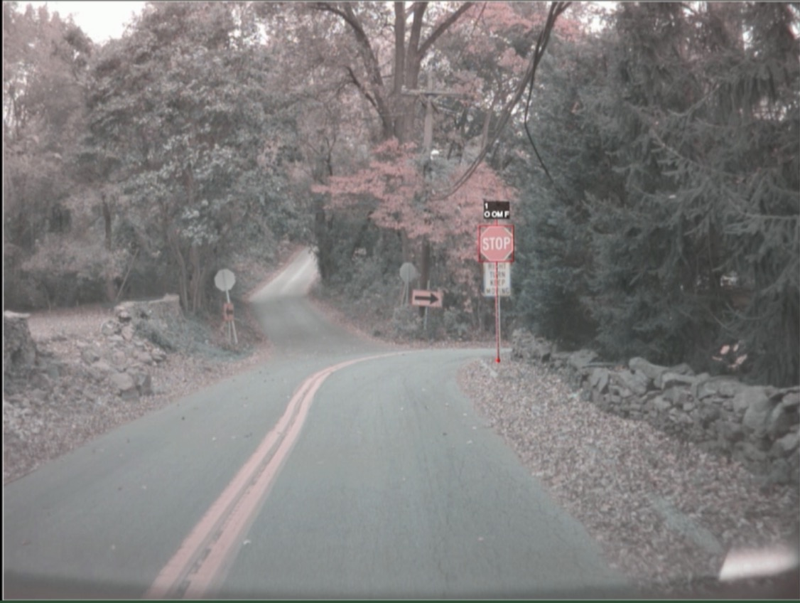
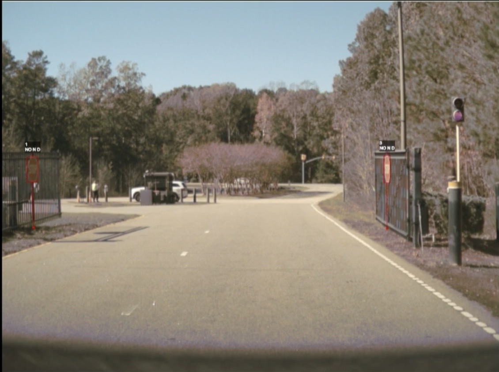
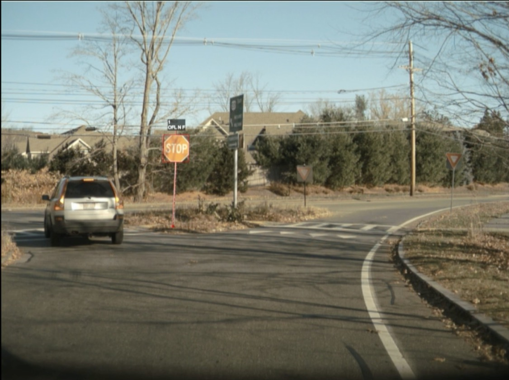
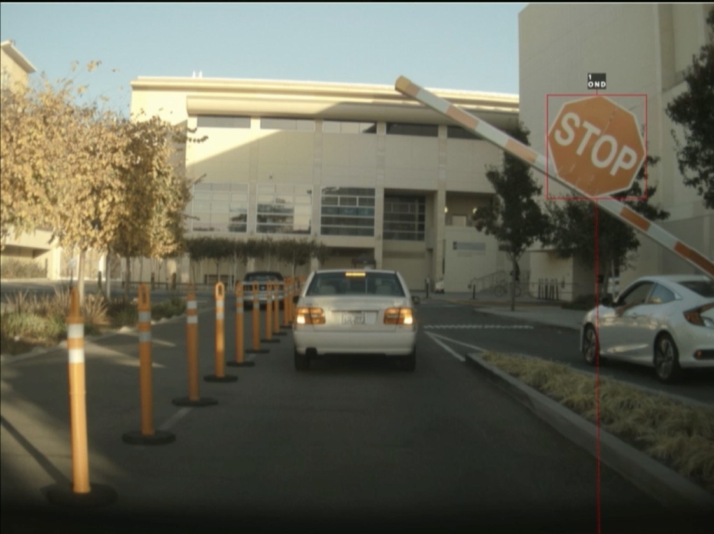

## [CVPR 2020](https://www.youtube.com/watch?v=g2R2T631x7k)
- [link in my Meeting Notes repo](https://github.com/patrick-llgc/MeetingNotes/blob/master/CVPR2020/workshops.md#scalability-in-autonomous-driving-video-on-youtube)

## [Pytorch Conf](https://www.youtube.com/watch?v=hx7BXih7zx8)
- [A very good review blog here](https://phucnsp.github.io/blog/self-taught/2020/04/30/tesla-nn-in-production.html)

## [Tesla Patents](https://patents.google.com/?q=(machine+learning)&assignee=Tesla%2c+Inc.&after=priority:20180101&oq=(machine+learning)+assignee:(Tesla%2c+Inc.)+after:priority:20180101)

## On FSD
- [Tweets from @phlhr](https://twitter.com/phlhr/status/1318335219586326529) and [another one](https://twitter.com/phlhr/status/1357924763214049285)