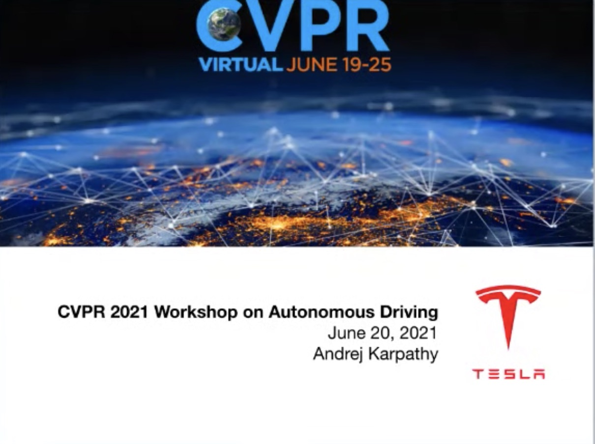
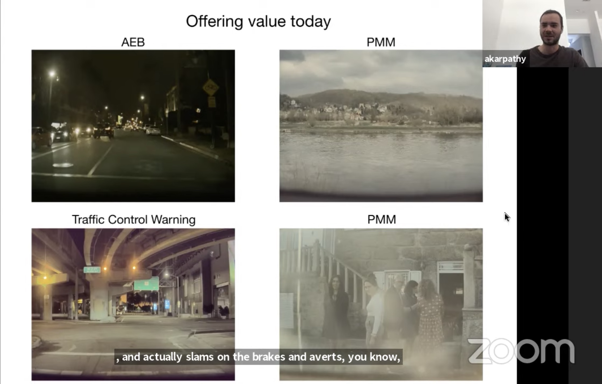
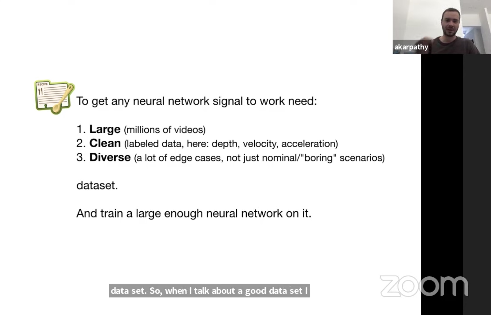
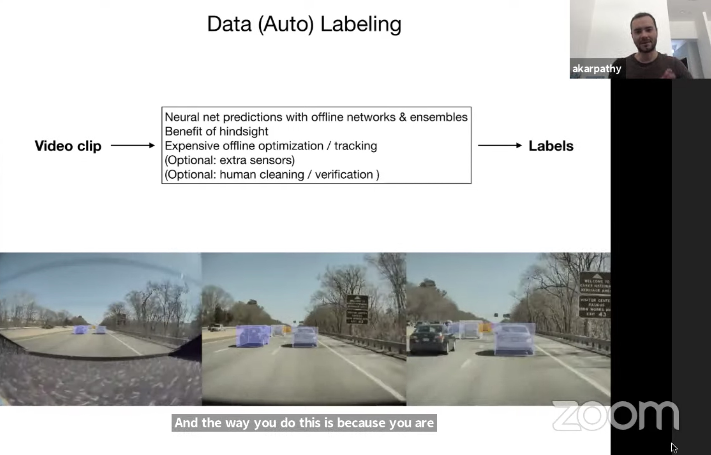
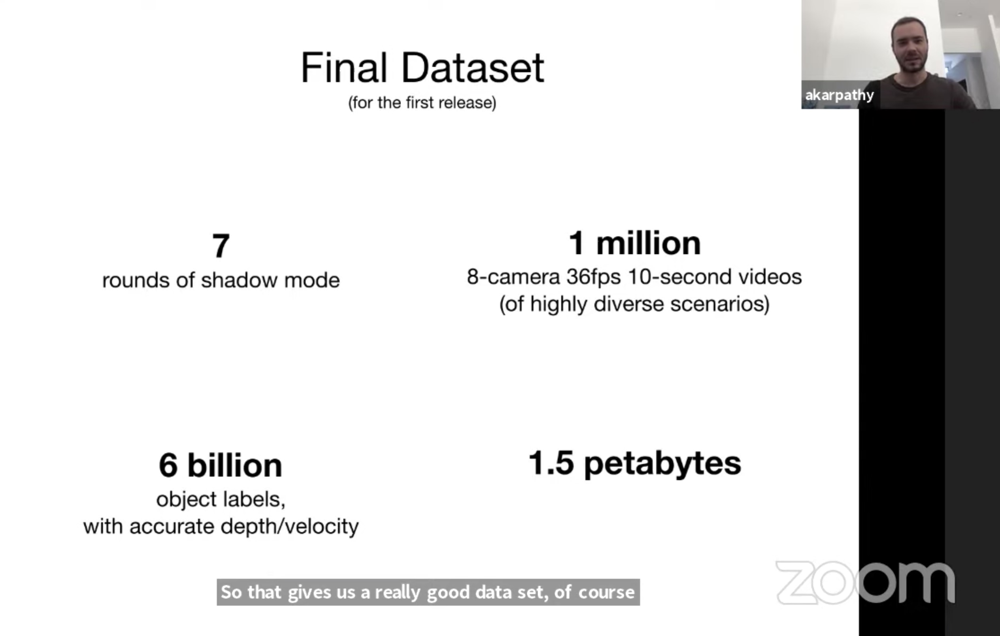
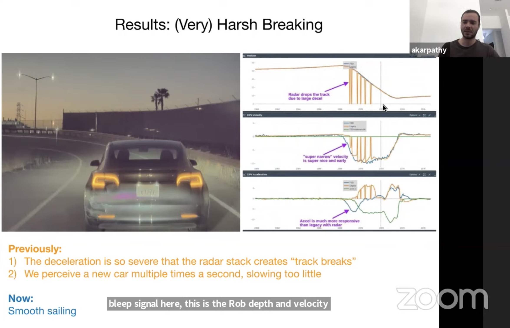
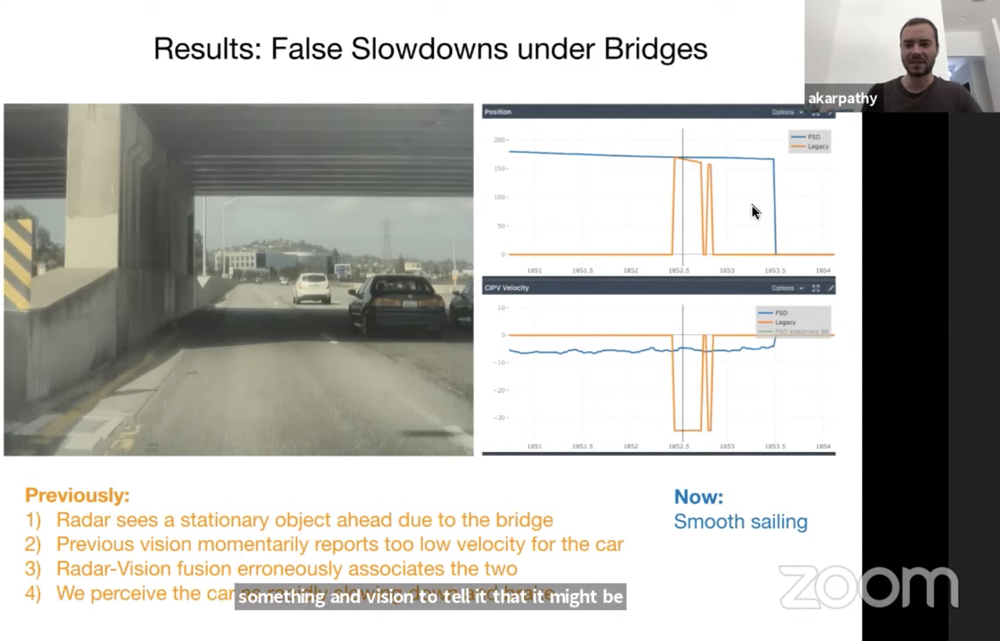
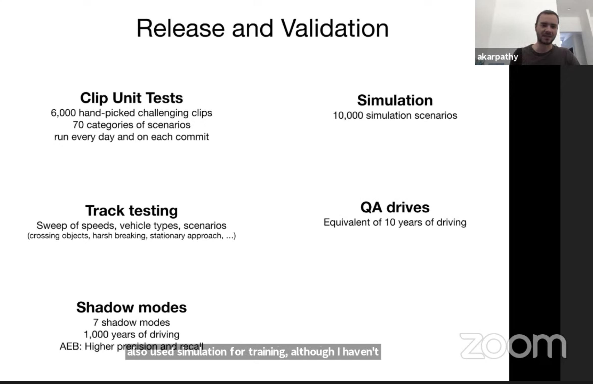

## [2021.06.20 CVPR 2021](https://www.youtube.com/watch?v=g6bOwQdCJrc)
- The grand mission: Tesla is ditching radars. They are using neural network and vision to do radar depth + velocity sensing.
- In order to do that, they need a large AND diverse 4D (3D+time) dataset. This is also used to train FSD. 
- Tesla has a whole team spending about 4 months focusing on autolabeling 
- Tesla uses MANY (221 as of mid-2021) triggers to collect the diverse dataset. They ended up with 1 million 10-second clips.
- Dedicated HPC team. Now Tesla training with 720 8-GPU nodes!
- Tesla argues that vision alone is perfectly capable of depth sensing. It is hard and it requires the fleet.

PMM: pedal misuse mitigation

Tesla's data set-up.

Have to figure out the road layout the first time the car goes there (drive on perception). Fundamental problem: Depth estimation of monocular 

Once in a while radar gives you a FP that is hard to handle

Validation process

