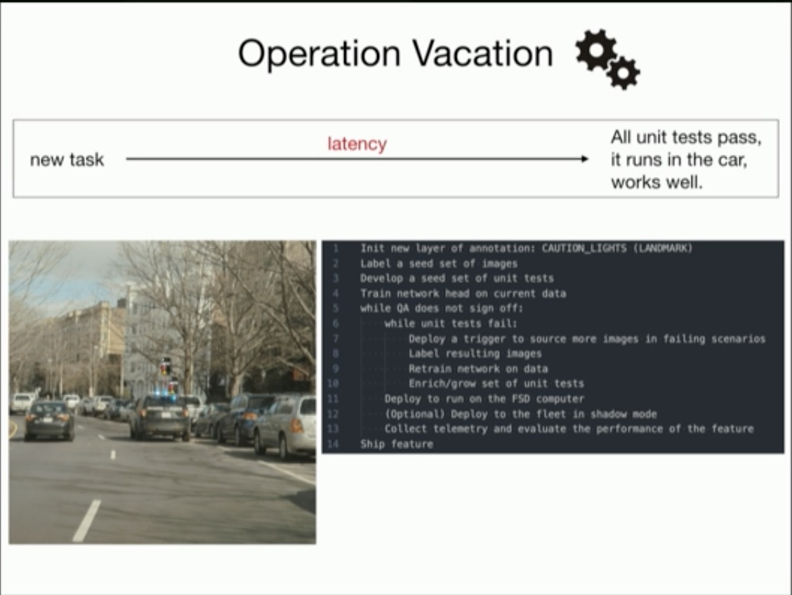
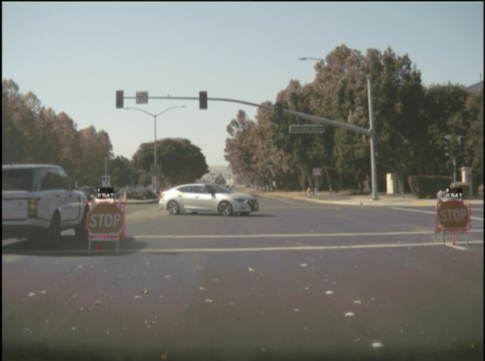
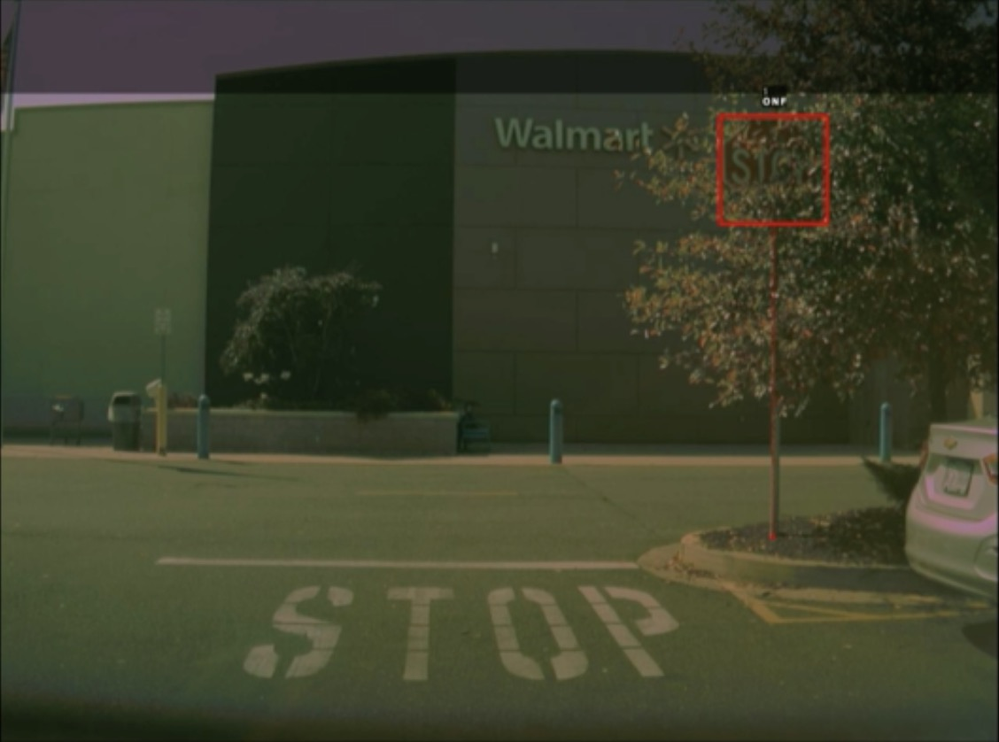
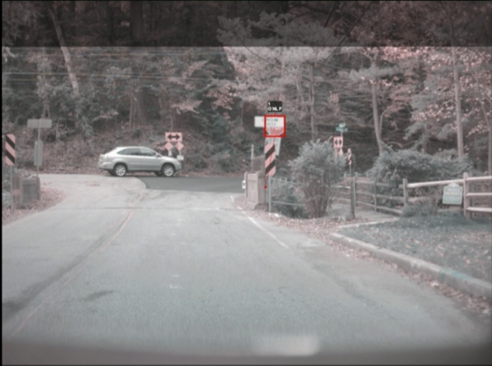
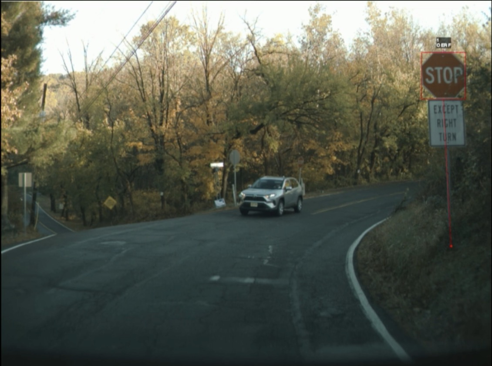
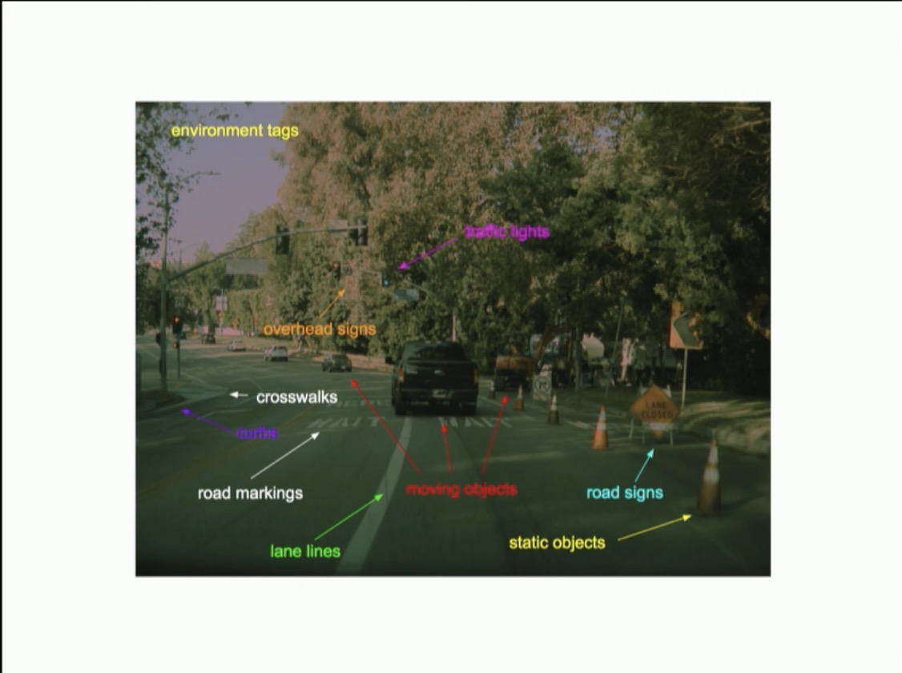

## [ScaledML 2020]()
- [Video](https://www.youtube.com/watch?v=hx7BXih7zx8)
- [Review by 黄浴](https://zhuanlan.zhihu.com/p/136179627)

Stuff that caught my eye:

- Even state-less SOD such as stop signs can be complex
	- active states and modifiers

- temporal flickering in shadow mode indicates corner case
- Test driven feature development

- BEVNet to learn local map from camera images

- Pseudo-lidar (Vidar) approach is promising in urban driving (40mx40m range)

- infrastructure: operational vacation

- Other pics

