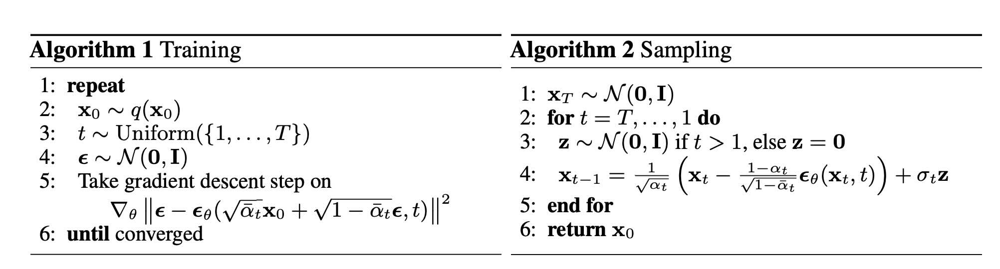
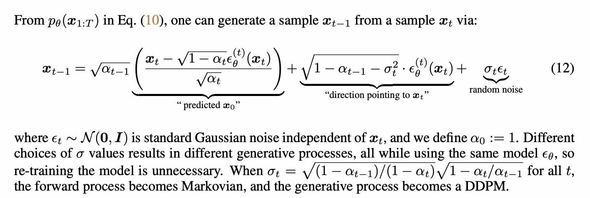
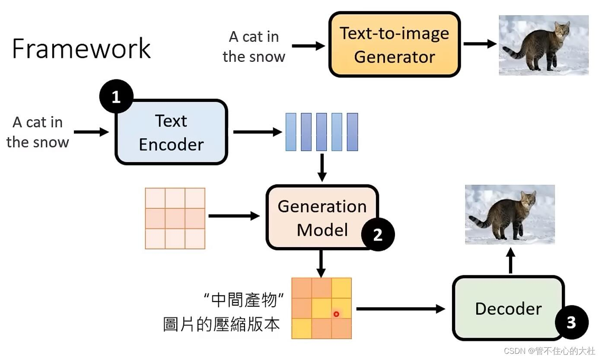
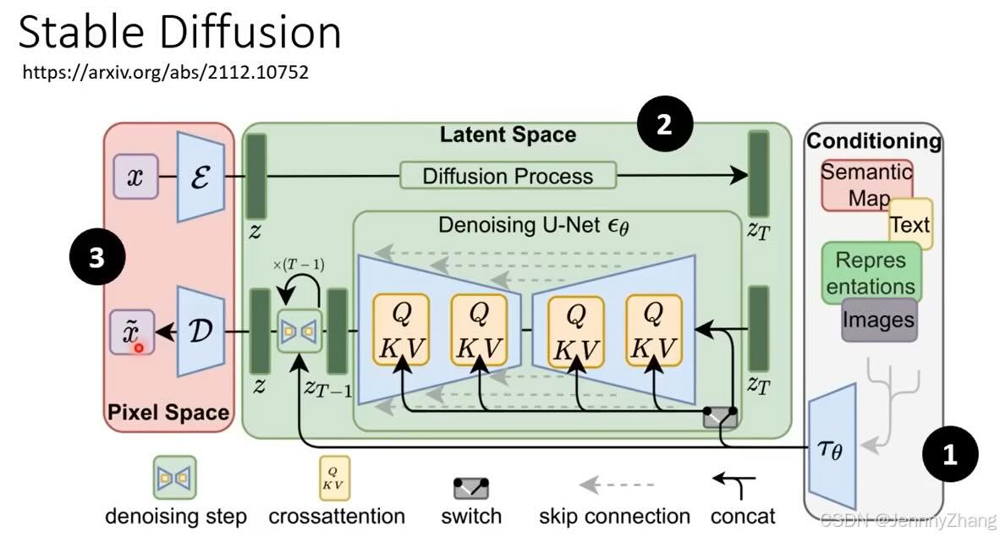
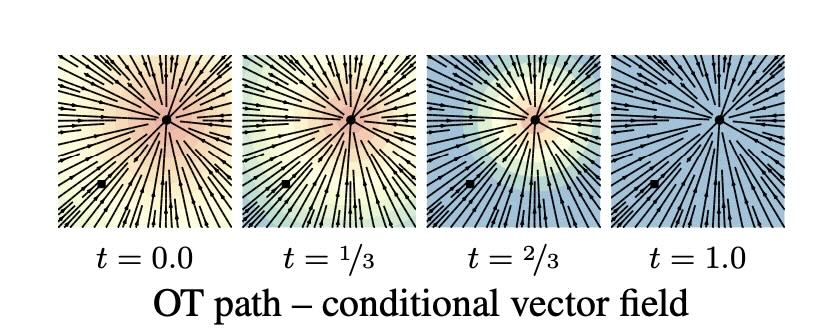
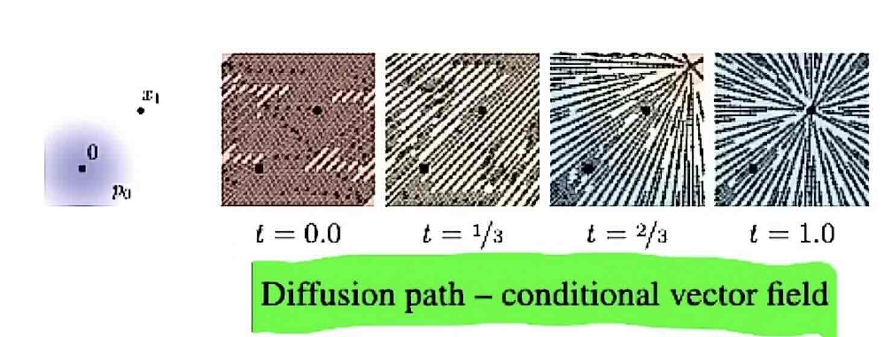
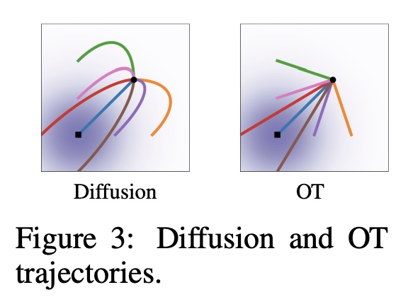
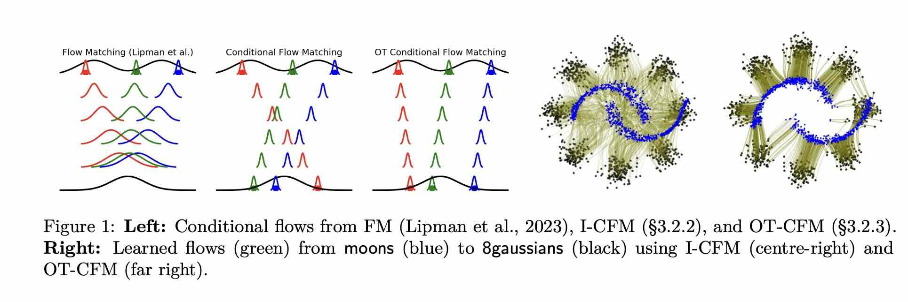

# Diffusion Models

## Paper list
- [DDPM: Denoising Diffusion Probabilistic Models](https://arxiv.org/abs/2006.11239) [Berkeley, Jonathan Ho, Pieter Abbeel]
- [DDIM: Denoising Diffusion Implicit Models](https://arxiv.org/abs/2010.02502) <kbd>ICLR 2021</kbd> [Stanford, Stefano Ermon]
- [score SDE: Score-Based Generative Modeling through Stochastic Differential Equations](https://arxiv.org/abs/2011.13456) <kbd>ICLR 2021 Oral</kbd> [Stanford, Yang Song, Stefano Ermon]
- [Improved DDPM: Improved Denoising Diffusion Probabilistic Models](https://arxiv.org/abs/2102.09672) [OpenAI, Prafulla Dhariwal]
- [Classifier Guidance: Diffusion Models Beat GANs on Image Synthesis](https://arxiv.org/abs/2105.05233) [OpenAI, Prafulla Dhariwal]
- [LDM: Latent Diffusion Model: High-Resolution Image Synthesis with Latent Diffusion Models](https://arxiv.org/abs/2112.10752) <kbd>CVPR 2022</kbd> [Stable Diffusion v1, Patrick Esser]
- [CFG: Classifier-Free Diffusion Guidance](https://arxiv.org/abs/2207.12598) <kbd>NeurIPS 2021</kbd> [Jonathan Ho, Google Brain]
- [Rectified flow: Flow Straight and Fast: Learning to Generate and Transfer Data with Rectified Flow](https://arxiv.org/abs/2209.03003) [Xingchao Liu, UT Austin, even earlier than flow matching paper]
- [Flow Matching for Generative Modeling](https://arxiv.org/abs/2210.02747) [FAIR]
- [DiT: Scalable Diffusion Models with Transformers](https://arxiv.org/abs/2212.09748) [Saining Xie]
- [OT-CFM: Improving and generalizing flow-based generative models with minibatch optimal transport](https://arxiv.org/abs/2302.00482) <kbd>TMLR 2023</kbd> [Alex Tong]
- [Mean Flows for One-step Generative Modeling](https://arxiv.org/abs/2505.13447) [Kaiming He]
- [iMF: Improved Mean Flows: On the Challenges of Fastforward Generative Models](https://arxiv.org/abs/2512.02012) [Kaiming He]

## References, Tutorials
- Video tutorials
    - [Diffusion Model: But how do AI images and videos actually work? | Guest video by Welch Labs](https://www.youtube.com/watch?v=iv-5mZ_9CPY&t=647s), 3 blue 1 brown
	- [Flow Matching for Generative Modeling (Paper Explained)](https://www.youtube.com/watch?v=7NNxK3CqaDk), Yannic Kilcher
	- [The Rise of Single-Step Generative Models [MeanFlow]](https://www.youtube.com/watch?v=swKdn-qT47Q), Jia-Bin Huang
	- [台大李宏毅教授扩散模型](https://www.bilibili.com/video/BV14c411J7f2/), bilibili, in Chinese
- Blogs
    - [生成扩散模型漫谈（四）：DDIM = 高观点DDPM](https://spaces.ac.cn/archives/9181), 苏剑林
博客
    - [生成扩散模型漫谈（六）：一般框架之ODE篇](https://spaces.ac.cn/archives/9228), 苏剑林
博客
	- [[ICLR2023] 扩散生成模型新方法：极度简化，一步生成](https://zhuanlan.zhihu.com/p/603740431), in Chinese on 知乎 by Xingchen Liu, 1st author of Rectified Flow, now at deepseek 
	- [通俗易懂的Flow Matching原理解读（附核心公式推导和源代码）](https://zhuanlan.zhihu.com/p/4116861550), in Chinese on 知乎
	- [笔记: 扩散模型，流匹配，一步生成MeanFlow](https://mp.weixin.qq.com/s/QvDqeLL3H7z6KF4pb1Pf7g), in Chinese on 微信公众号
	- [An introduction to Flow Matching](https://mlg.eng.cam.ac.uk/blog/2024/01/20/flow-matching.html), Cambridge

- Notebooks	
	- [ipython notebook to show case flow matching](https://github.com/atong01/conditional-flow-matching/blob/main/examples/2D_tutorials/Flow_matching_tutorial.ipynb), by Alex Tong, from OT-CFM paper repo

	
	
## Raw Q and A notes

@2025 Christmas, Lina and Patrick

### Illustrations
* DDPM


* DDIM

* Latent diffusion


* Flow Matching

### DDPM, DDIM, Latent Diffusion

Q: diffusion equation formulation and why this form
x_t = \sqrt{\bar{\alpha}_t} \, x_0 + \sqrt{1 - \bar{\alpha}_t} \ \epsilon
\epsilon \sim \mathcal{N}(0, I)
The noise addition is defined as a linear mix:
x_t = a_t * x_0 + b_t * ϵ, where ϵ ~ N(0, I). x_0 is the clean image. 
The coefficients are chosen to satisfy a_t^2 + b_t^2 = 1. This keeps the process stable and ensures it ends as pure Gaussian noise.

Q: why alpha only goes down to 0.98 but not smaller. 
A: In diffusion models, each step adds only a tiny amount of noise (so \alpha_t αt stays close to 1), but over many steps these small corruptions accumulate until the signal is almost entirely destroyed.
\alpha_t αt controls per-step noise and must stay near 1 for stable training.
\bar{\alpha}_t is the cumulative effect and therefore decays toward zero.
This design enables gradual, reversible corruption instead of abrupt noise injection.

Q: intuition about DDIM
A: Controlled ascent to hill peak. 
Analogy/Assumption: The clean image lies at the peak of a landscape, and noisy image at the valley. Adding noise (diffusion process) is going downhill and denoising is going uphill.
Intuition: Going directly to the peak form the valley is an ill posed problem so we need to find intermediate foothold. How do we find this foothold? DDIM first estimate where the peak (clean image) is, then deliberately moves downhill using the diffusion process formulae to find a stable intermediate foothold. Then repeat the process toward the next foothold.
先定位目标山峰，再利用已知规律（扩散原理）进行定点跳跃

Q: DDIM sampling difference from DDPM
A: DDIM is a deterministic sampler. Same noise seed —> same output. 

Q: Is DDIM still used or SOTA?
A: Yes it is still one of the usable sampling methods. Latent diffusion uses DDIM. There are better sampling methods out there but DDIM is still a very good choice. 

Q: what is the difference between “stable diffusion” and “latent diffusion”?
A: "Latent Diffusion" is the technical framework, while "Stable Diffusion" is a specific, well-known implementation (a productized instance) of this method. Stable Diffusion is an open-source image generation model publicly released in 2022 by Stability AI, CompVis, and Runway ML.

Q: Is latent diffusion still SOTA?
A: largely yes. DALL-E series and Imagen series are all variants of latent diffusion. DiT updates the arch but also uses latent diffusion.

Q: difference between diffusion transformer (DiT) and latent diffusion
A: DiT still denoises in latent space, but replaced UNet with transformer architecture for better scalability.

Q: current SOTA arch
A: DDPM training noise scheduling in training + cosine noise scheduling + DDIM sampling + learning in latent space + DiT arch

Q: SOTA as of 2024/02 (Sora time). Not too much changed till now (2025/12), for the past three years since it was released.
DiT: Scalable Diffusion Models with Transformers, https://arxiv.org/pdf/2212.09748 
Transformer + latent diffusion

Q: What is CFG
A: CFG 
p-inconditional=.1 is common sense now during training.
Sampling guidance strength w needs to be ablated well, for each
CFG needs two feed forward in inference, thus slow.

Q: Why the name free in CFG? What is classifier guidance?
A: What is Classifier Guidance
1. An unconditional diffusion model learned the general data distribution.
2. A separately pre-trained classifier learned to recognize object categories from noisy images.
   During sampling, gradients from this classifier were used to "steer" the diffusion process toward a target class (e.g., "dog"). While clever, this approach was cumbersome, limited to simple labels, and often unstable.
The Decoupling Insight: Classifier Guidance was born from a practical constraint: directly training high-quality conditional diffusion models on complex data (like text) was very difficult at the time. The decoupling strategy was a brilliant "shortcut".

Q: what is DDPM predicting exactly by predicting the noise?
A: The diffusion model does not need to infer how noisy the image is. That information is explicitly given via the timestep. Noise schedule is fixed hyper parameter and does not need to be learned. 
So the task becomes: “Given a known noise level, estimate the exact noise realization.”
This makes the training stable and well posed, as the scale of the target (ε) is fixed (unit variance).
At any noisy point, the direction back toward the data manifold is locally well-defined, even if you don’t know where on the manifold you are.  That direction is the noise.
It is also learning the correction, or residual. Neural networks learn corrections far more easily than absolute mappings.

Q: if every step of predicting the noise is deterministic, where does the multimodality come from?
A: The DDPM model defines a landscape and gravity. Noise decides where you step.
More formally, The score network defines a vector field pointing toward high-density regions. Sampling injects noise that determines which basin of attraction you fall into.

### [Score SDE](https://arxiv.org/abs/2011.13456)
Q: what is a score function
A: Historically, the gradient of log likelihood is called a score. The name comes from classical statistics, not ML.
Score = ∇x​logp(x)​
Score function of a standard Gaussian is s(x) = dlogp(x) = -x, it is linear
Score is the gradient of the log likelihood or log density. Note that this is NOT the same as gradient gf likelihood. dlogp = dp/p 
Why dp is not a good measure? Going from 0.0001 → 0.0002 (100% increase) vs. 0.9 → 0.91 (1% increase). The former should be favored, but dp would favor the later. dlogp is scale invariant, dp/p. 
In physics, Heat flows according to gradients of log density of states, not absolute counts. Temperature gradient. 

Q: how does noise and score connect to each other
A: Although the network outputs noise, that output is a scaled score estimate.
So DDPM is really learning: “Given a noisy sample at noise level t, which direction should I move to become more like real data?” That’s exactly what the score is.
DDPM is learning a time-dependent score-based model sθ.

Q: Relationship between DDPM and score SDE
A: DDPM is a special (discrete-time) case of the Variance Preserving (VP) SDE.

Q: relationship between DDIM and score-SDE? Both are from the same lab in Stanford
A: they are concurrent work and did not cite each other explicitly.
DDIM (2020) introduced deterministic sampling heuristically from DDPM without SDE/ODE language.
Score-SDE (2020/2021) introduced the continuous SDE framework and the probability flow ODE, but did not cite DDIM.
Later expository work (e.g., blogs and tutorials from 2022/2023) were the first to explicitly connect DDIM and the probability-flow ODE — showing mathematically that DDIM is effectively a discrete Euler solver of that ODE. [Scientific Spaces: 生成扩散模型漫谈（六）：一般框架之ODE篇](https://spaces.ac.cn/archives/9228)

Q: Probability flow ODE
A: . For all diffusion processes, there exists a corresponding deterministic process whose trajectories share the same marginal probability densities as the SDE.

Q: why there is a 1/2 in Probability flow ODE but no 1/2 in reverse SDE?
A: The ½ compensates for removing the stochastic noise while preserving the same marginal density evolution.
Diffusion as Half of the spread coming from random noise + Half coming from deterministic drift of probability mass

Q: what is the relationship between DDIM and probability flow ODE?
A: DDPM is a first-order Euler–Maruyama solver of the reverse-time SDE.
DDIM is a first-order deterministic Euler solver of the probability flow ODE.

Q: What is the industry practice for diffusion and flow matching when it comes to video generation and policy leanring?
A: Diffusion models dominate generative modeling, while flow-matching–based methods dominate policy and control—because one prioritizes diversity, and the other prioritizes stability and determinism.
Video & image generation → stochastic diffusion (DDPM / DDIM / EDM) still dominate
Stable Diffusion, Imagen, Sora-style video models
are all diffusion-based or diffusion-derived. Even when accelerated (DDIM, DPM-Solver, EDM), they retain stochasticity.
Policy / control / robotics → deterministic methods (Flow Matching, Rectified Flow, ODE-based models) dominate. Deterministic outputs. 
Rectified Flow = Flow Matching with linear interpolation paths, very fast but still under heavy investigation. 
Flow matching in robotics
Flow Matching (FM) by itself is not inherently faster than diffusion models in practice.
Rectified Flow (RF) is significantly faster because it removes iterative stochastic sampling and turns generation into (almost) a single-pass deterministic mapping.

Q: what is Langevin dynamics and its relationship to ddPM?
A: DDPM = Annealed Langevin Dynamics (ALD)
The gradient term pulls samples toward regions of high probability
The noise term prevents collapse into a single mode
Gradient descent + noise = sampling
This is also the root cause of the noise term in DDPM. 

Q: why DDPM sampler cannot work without noise term (essetially langevin dynamics) but ddim can work with noise?
A: DDPM cannot work without noise because it is sampling from a stochastic process (a diffusion), while DDIM works without noise because it follows a deterministic flow that preserves the same marginals.
In other words, DDPM is solveing a reverse time SDE which requires noise. DDIM solves probablity flow ODE, which does not require noise. 
DDPM works by simulating a stochastic diffusion process (a reverse-time SDE). The noise term is essential — it’s what allows the sampler to correctly explore and reproduce the target probability distribution. Removing the noise breaks the mathematics of the process.
DDIM works because it switches to a different equation — a deterministic probability flow ODE that has the same marginals as the stochastic diffusion. It doesn’t “remove” noise from DDPM; it solves a different (but equivalent) equation that doesn’t require noise at all.

Q: If DDIM is deterministic, how can it generate diverse samples?
A: DDIM preserves multimodality because randomness is injected once at initialization, and the deterministic flow preserves that randomness through to the final sample.
This is why DDIM is deterministic but not degenerate.
For DDPM, noise enters at every stage. 
The ODE transports probability mass deterministically
The SDE diffuses probability mass stochastically

Q: practical benefits of score SDE
A: Score-based SDEs unified diffusion models under a deterministic ODE view, enabling fast, stable generation and directly giving rise to flow matching, rectified flow, and modern diffusion-based generative models.

### Flow Matching
Q: is flow matching the SOTA in image/video generation?
A: SOTA Stable Diffusion 3、Meta MovieGen, FLUX.2, WAN2.1 all used flow matching to replace diffusion. To be exact, all used RF execpt. 

Q: FM is often called simulation-free. What does it mean?
A: Simulation-free training in Flow Matching means that training does not require simulating stochastic diffusion trajectories (adding noise to simulate the diffusion process); instead, the model learns a deterministic velocity field from direct samples of data and noise.

Q: what is the relationship between flow matching and DDPM?
A: diffusion models can be seen as a special case within the flow-matching framework.
It also trains more stably. When using the diffusion probability paths within the flow matching objective, the resulting training is often more robust and stable than standard diffusion training (e.g., score matching or denoising loss in DDPM).
FM uses deterministic ODE flows rather than stochastic one (SDE) sampling typical in DDPM.

Q: flow matching training is based on ODE and not SDE?
A: yes exactly. DDPM is trained and inferences on SDE. DDIM is trained with SDE (same as DDPM) but inference on ODE. FM trains and inferences on ODE.
Note that score SDE also trains on SDE but inferences on ODE. Score SDE leans the score (scaled version of the noise) which is still based on SDE. 
Once Score SDE is trained, the sampling process can be stochastic like DDPM (based on reverse time SDE) or deterministic (based on probability flow ODE).

Q: what is a flow?
A: A flow is the collection of all trajectories (paths) generated by a vector field, one trajectory for each initial point.
In other words, a flow is the family of trajectories induced by a vector field over time. Thus a vector field defines a flow. 
Flow is a transformation of a distribution, by definition.
The velocity is flow velocity.

Q: what is a probability density map?
A: probability density path p : [0, 1] × R^d → R>0, which is a time dependent1 probability density function
The prob path p_t(x|x_1) connects p(x) starting point and true data distribution x1~q(x)

Q: training objective of FM?
A: a conditional flow matching objective, which will results in the same optima as the flow matching objective (which is intractable to compute) 

Q: FM trains faster and samples faster
A: Not necessarily but only with Optimal transport (OT). Flow matching with diffusion objectives will be the same as score matching with diffusin objective (DDPM).

Q: what are the popular solvers for FM?
A: once we reformulate the problem as solving an ODE, then better methods are available, such as the Heun (RK2, runge-kutta-2nd-order) = best practical tradeoff (Euler = cheap, rough, or RK1 method). 
Specifically, SD3 and MovieGen used Euler as sampling method. 

Q: why diffusion trajectory always overshoots and curves back?
A: [very handwavy] in the noise adding process, noise spread in all directions and then gravitates toward true gaussian distribution. Reversing this process is an overshooting behavior. 
Also stochasticity means that overshooting is necessary. It is expected behavior. 

Q: why is the vector field constant in time?
A: is because the vecor field is a time derivative of the flow phi ψ. The flow is defined as a constant move toward the target in a straight line, and thus the vector field is constant wrt t. 

Q: is x0 and x1 in FM paired?
A: In Flow Matching, x_0 and x_1 are independently sampled; the model learns a global transport field, not pointwise correspondences.

### Rectified flow (RF) and reflow, OT-CFM
Q: RF and FM relationship
A: Rectified Flow (Liu et al.) was published in Sep 2022	and Flow Matching (Lipman et al.) was publihsed in Oct 2022. They are independent and roughly arrived at the same idea. 
Note in literature, it is quite common for people to use RF and FM interchangeably, such as in the SD3 paper. 

Q: RF, reflow and SOTA
A: Rectified flow formulation (linear interpolation + velocity regression) has been widely adopted in industry SOTA models.
Iterative “reflow” training procedure from the original paper has not been integrated into major production models.
The term “rectified flow” in industry almost always refers to the formulation, not the reflow algorithm.

Q: FM already proposes OT. How does rectified flow improve upon it?
A: Flow Matching assumes a coupling and finds the best transport for it. Rectified Flow improves the coupling itself. 
Vanilla Flow Matching = conditional OT under a fixed coupling
In OT-CFM paper, reflow is called OT-CFM and FM is called I-CFM (independent coupling). Concretely, instead of x0, x1 being sampled independently from their marginal distributions, they are sampled jointly according to the optimal transport map π.

Q: training and inference impact of RF
A: Rectified Flow (RF) trades extra training cost for much cheaper, faster, and more stable inference.

Q: what other ways to straighten the flow?
A: OT-CFM proposed to solve minibatch OT. Essentially, 
Step 1: π ← OT(x1, x0), Step2: (x0, x1) ~ π. OT using sinkhorn algorithm (a soft and GPU friendly version of hard Hungarian matching). OT minimizes the cost, which is L2 distance between the samples. 

### Meanflow, iMF (latest as of 12/2025)

